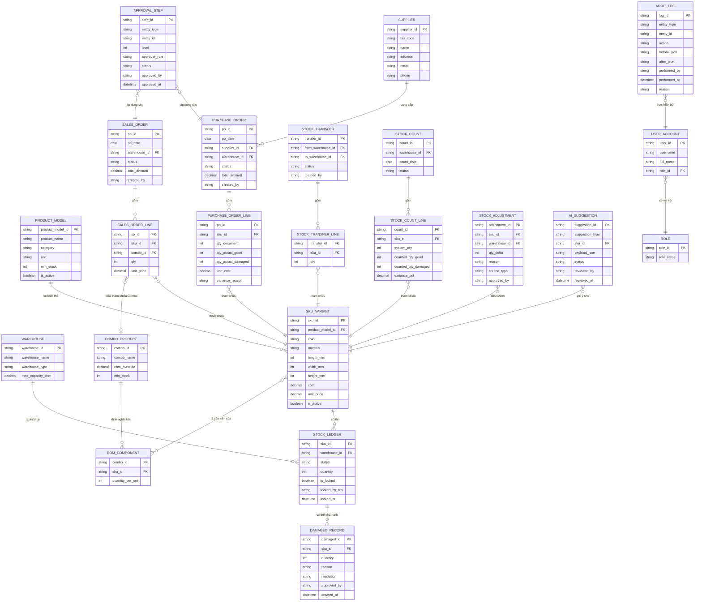
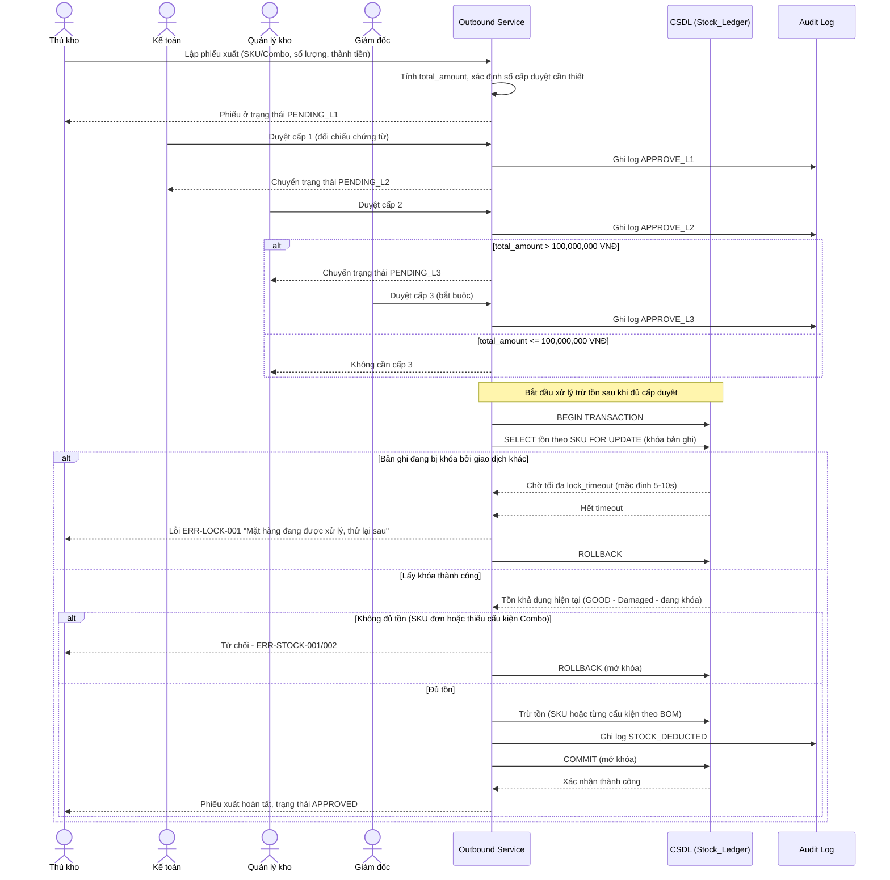
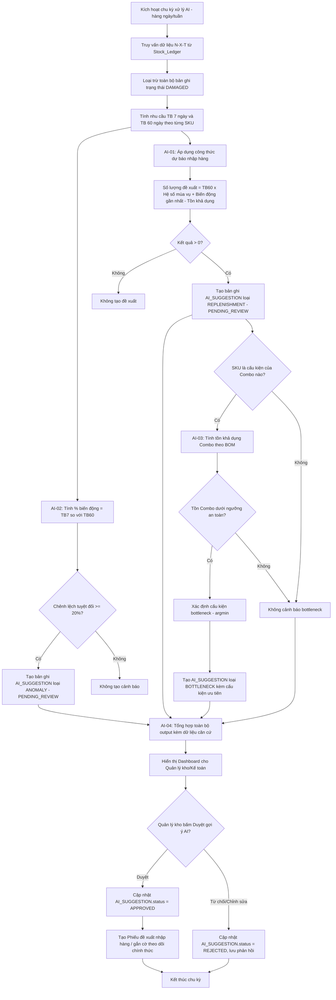
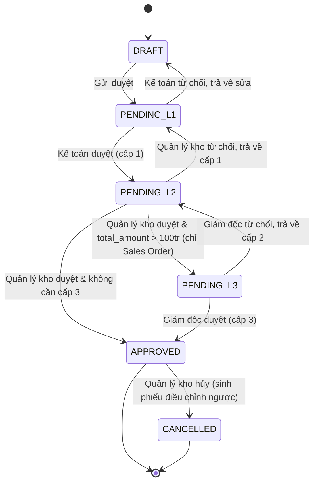
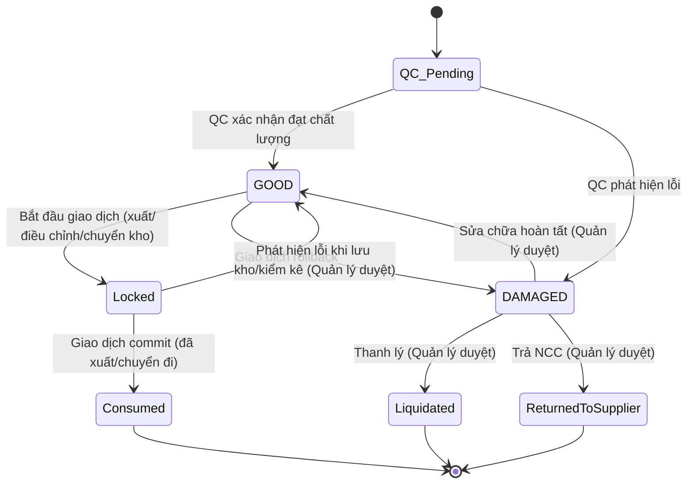

# FILE: SRS_Furniture_WMS.md

# ĐẶC TẢ YÊU CẦU PHẦN MỀM (SOFTWARE REQUIREMENTS SPECIFICATION)
## HỆ THỐNG QUẢN LÝ KHO NỘI THẤT CÓ TÍCH HỢP AI

| Thông tin | Giá trị |
|---|---|
| Mã tài liệu | SRS-WMS-AI-FURNITURE-001 |
| Phiên bản | 1.0 |
| Nguồn đầu vào | URD-WMS-AI-002 (v2.0) – Kho Nội thất tích hợp AI |
| Đối tượng đọc | Development Team, QA/Test, DevOps, Product Owner |
| Trạng thái | Baseline cho thiết kế chi tiết (Detailed Design) và phát triển |

### Quy ước ký hiệu
| Ký hiệu | Ý nghĩa |
|---|---|
| SRS-F | Software Functional Requirement |
| SRS-NF | Software Non-Functional Requirement |
| SRS-AI | AI/ML Requirement |
| SRS-DATA | Data Requirement |
| API | Application Programming Interface (REST) |
| CBM | Cubic Meter (m³) |
| BOM | Bill of Materials |
| SKU | Stock Keeping Unit |
| RBAC | Role-Based Access Control |
| PL | Pessimistic Locking |

---

## MỤC LỤC
1. Tổng quan hệ thống
2. Actor, Vai trò và Ma trận phân quyền
3. Kiến trúc tổng thể & Nguyên tắc thiết kế
4. Yêu cầu chức năng (Functional Requirements)
5. Luồng nghiệp vụ chi tiết (Business Process Specification)
6. Yêu cầu AI (AI Requirements)
7. Mô hình dữ liệu & Biểu đồ (ERD, Sequence, Flowchart)
8. Yêu cầu phi chức năng (Non-Functional Requirements)
9. Đặc tả API tổng quát
10. Ma trận truy vết yêu cầu (Traceability Matrix)
11. Tiêu chí nghiệm thu (Acceptance Criteria)
12. Phụ lục: Danh sách mã lỗi & Thông báo hệ thống

---

## 1. Tổng quan hệ thống

### 1.1. Mục tiêu
Xây dựng hệ thống Quản lý Kho Nội thất (Warehouse Management System – WMS) tích hợp AI nhằm:
- Số hóa toàn bộ quy trình nhập – xuất – tồn – kiểm kê – chuyển kho, thay thế thao tác Excel thủ công.
- Quản lý chính xác đặc thù ngành nội thất: kích thước/thể tích (CBM), hàng Combo/BOM, biến thể SKU (màu sắc, chất liệu), và hàng lỗi (Damaged).
- Đảm bảo tính toàn vẹn dữ liệu tồn kho thông qua cơ chế giao dịch có khóa (Pessimistic Locking), tránh xuất vượt tồn khi nhiều người thao tác đồng thời.
- Tự động hóa báo cáo Nhập – Xuất – Tồn (N-X-T) và cung cấp năng lực AI: dự báo nhu cầu nhập hàng, phát hiện biến động bất thường, cảnh báo nghẽn cổ chai cấu kiện Combo — với cơ chế con người xác nhận (Human-in-the-loop) trước khi áp dụng vào nghiệp vụ.
- Cung cấp workflow phê duyệt phiếu đa cấp (2–3 cấp) và audit log đầy đủ phục vụ kiểm toán, lưu tối thiểu 5 năm.

### 1.2. Phạm vi hệ thống
Hệ thống bao gồm các phân hệ (module):
1. **Master Data**: Hàng hóa (Product Model), Biến thể SKU, Combo/BOM, Nhà cung cấp, Kho/Kho chi nhánh.
2. **Inbound**: Phiếu nhập kho, phân loại chất lượng (QC – Tốt/Damaged).
3. **Outbound**: Phiếu xuất kho (SKU đơn lẻ và Combo).
4. **Inventory Control**: Tồn kho theo trạng thái (GOOD/DAMAGED), khóa bản ghi giao dịch, kiểm kê định kỳ, điều chỉnh tồn.
5. **Transfer**: Chuyển kho nội bộ.
6. **Approval Workflow**: Phê duyệt phiếu đa cấp theo giá trị và loại giao dịch.
7. **Reporting**: Báo cáo N-X-T, báo cáo CBM, báo cáo hàng Damaged, xuất Excel/PDF.
8. **AI Insight**: Dự báo nhập hàng, phát hiện biến động, cảnh báo bottleneck Combo, sinh nhận xét báo cáo.
9. **Audit & Security**: Audit log, RBAC, quản lý người dùng.

### 1.3. Ngoài phạm vi
- Phân hệ kế toán tổng hợp (General Ledger), tích hợp hóa đơn điện tử.
- Quản lý vận tải (TMS) và tối ưu tuyến đường giao hàng.
- Chính sách giá/khuyến mãi bán hàng (Pricing Engine) — chỉ lưu đơn giá tham chiếu phục vụ tính thành tiền trên phiếu.

---

## 2. Actor, Vai trò và Ma trận phân quyền

### 2.1. Danh sách Actor

| Actor | Mô tả |
|---|---|
| Nhân viên (Staff) | Lập chứng từ nháp (phiếu nhập/xuất dự thảo) |
| Thủ kho (Warehouse Keeper) | Thao tác nhập/xuất/chuyển kho/kiểm kê; gắn cờ hàng Damaged |
| Nhân viên QC | Kiểm tra chất lượng hàng khi nhập, phân loại Tốt/Damaged |
| Kế toán (Accountant) | Duyệt sơ bộ (cấp 1), đối chiếu chứng từ, xem báo cáo |
| Quản lý kho (Warehouse Manager) | Duyệt cấp 2 (duyệt cuối), duyệt gợi ý AI, duyệt xử lý hàng Damaged, hủy phiếu |
| Giám đốc (Director) | Duyệt cấp 3 — chỉ áp dụng cho phiếu xuất có giá trị > 100.000.000 VNĐ |
| Quản trị hệ thống (System Admin) | Cấu hình hệ thống, quản lý người dùng/phân quyền, cấu hình lock timeout |
| Hệ thống AI (AI Engine) | Actor kỹ thuật: sinh nhận xét, gợi ý, cảnh báo (không có quyền ghi dữ liệu nghiệp vụ) |

### 2.2. Ma trận phân quyền RBAC (CRUD + Approve)

| Chức năng | Nhân viên | Thủ kho | QC | Kế toán | Quản lý kho | Giám đốc | Admin |
|---|---|---|---|---|---|---|---|
| Tạo phiếu nhập (nháp) | C | C | - | - | - | - | - |
| Lập/sửa phiếu nhập (chưa duyệt) | - | CRU | - | - | - | - | - |
| QC phân loại Tốt/Damaged | - | - | CRU | - | - | - | - |
| Duyệt phiếu nhập (cấp 1) | - | - | - | Approve | - | - | - |
| Duyệt phiếu nhập (cấp 2) | - | - | - | - | Approve | - | - |
| Lập/sửa phiếu xuất (chưa duyệt) | - | CRU | - | - | - | - | - |
| Duyệt phiếu xuất ≤ 100 triệu (cấp 1 → 2) | - | - | - | Approve | Approve | - | - |
| Duyệt phiếu xuất > 100 triệu (cấp 3) | - | - | - | - | - | Approve | - |
| Hủy phiếu đã duyệt | - | - | - | - | R+Request | Approve | - |
| Chuyển kho nội bộ | - | CRU | - | - | Approve | - | - |
| Lập phiếu kiểm kê | - | CRU | - | - | - | - | - |
| Duyệt phiếu điều chỉnh tồn (>5%) | - | - | - | R | Approve | - | - |
| Gắn cờ hàng Damaged | - | CRU | CRU | - | - | - | - |
| Duyệt phương án xử lý Damaged | - | - | - | - | Approve | - | - |
| Xem báo cáo N-X-T/CBM/Damaged | - | R | - | R | R | R | R |
| Xuất Excel/PDF | - | R | - | CR | CR | R | - |
| Xem gợi ý AI | - | - | - | R | R | R | - |
| Duyệt gợi ý AI (Human-in-the-loop) | - | - | - | - | Approve | - | - |
| Quản lý danh mục hàng hóa/CBM/Combo/BOM/Biến thể | - | CRU | - | - | CRUD | - | - |
| Quản lý người dùng & phân quyền | - | - | - | - | - | - | CRUD |
| Cấu hình lock timeout, retry | - | - | - | - | - | - | CRUD |

Ghi chú: `C` = Create, `R` = Read, `U` = Update, `D` = Delete, `Approve` = có quyền phê duyệt bước tương ứng.

### 2.3. Quy tắc workflow phê duyệt (Approval Workflow Rules)

| Loại phiếu | Cấp 1 | Cấp 2 | Cấp 3 (điều kiện) |
|---|---|---|---|
| Phiếu nhập kho | Kế toán duyệt sơ bộ (đối chiếu chứng từ NCC) | Quản lý kho duyệt cuối | Không áp dụng |
| Phiếu xuất kho ≤ 100.000.000 VNĐ | Kế toán duyệt sơ bộ | Quản lý kho duyệt cuối | Không áp dụng |
| Phiếu xuất kho > 100.000.000 VNĐ | Kế toán duyệt sơ bộ | Quản lý kho duyệt | **Giám đốc duyệt bắt buộc** |
| Phiếu điều chỉnh tồn (lệch kiểm kê > 5%) | Thủ kho lập | Quản lý kho duyệt | Không áp dụng |
| Phiếu chuyển kho nội bộ | Thủ kho lập | Quản lý kho duyệt | Không áp dụng |
| Đổi trạng thái GOOD ↔ DAMAGED | Thủ kho/QC ghi nhận | Quản lý kho duyệt | Không áp dụng |
| Gợi ý AI (nhập hàng, xử lý biến động) | AI Engine sinh gợi ý | Quản lý kho duyệt ("Duyệt gợi ý AI") | Không áp dụng |

**SRS-F-000 (Business Rule tổng quát):** Một phiếu chỉ chuyển sang trạng thái "Đã duyệt" và ảnh hưởng đến tồn kho sau khi đã đi qua **đủ và đúng thứ tự** các cấp duyệt quy định ở trên. Hệ thống không cho phép bỏ qua cấp hoặc duyệt sai thứ tự (VD: Quản lý kho không thể duyệt trước khi Kế toán duyệt).

---

## 3. Kiến trúc tổng thể & Nguyên tắc thiết kế

### 3.1. Kiến trúc logic (Layered Architecture)

```
┌─────────────────────────────────────────────┐
│  Presentation Layer (Web UI / Mobile App)    │
├─────────────────────────────────────────────┤
│  API Gateway (REST, xác thực JWT, rate limit)│
├─────────────────────────────────────────────┤
│  Application/Service Layer                   │
│   - Inbound Service    - Outbound Service    │
│   - Inventory Service  - Approval Service    │
│   - Transfer Service   - Reporting Service   │
│   - AI Orchestration Service                 │
├─────────────────────────────────────────────┤
│  Domain Layer (Business Rules, BOM Engine,   │
│   CBM Calculator, Locking Manager)           │
├─────────────────────────────────────────────┤
│  Data Access Layer (ORM / Repository)        │
├─────────────────────────────────────────────┤
│  CSDL quan hệ (PostgreSQL/SQL Server)        │
│  + Cache (Redis) cho khóa phân tán (nếu scale│
│    nhiều instance)                           │
├─────────────────────────────────────────────┤
│  AI/ML Service (tách rời, gọi qua API nội bộ)│
│   - Forecasting Engine                       │
│   - Anomaly Detection Engine                 │
│   - LLM Narrative Generator (nhận xét báo cáo)│
└─────────────────────────────────────────────┘
```

### 3.2. Nguyên tắc thiết kế cốt lõi
- **Nguyên tắc 1 – Single Source of Truth cho tồn kho:** Bảng `stock_ledger` là nguồn duy nhất xác định tồn; mọi module khác (báo cáo, AI) chỉ đọc, không được ghi trực tiếp.
- **Nguyên tắc 2 – Transaction toàn vẹn (ACID):** Mọi thao tác thay đổi tồn phải nằm trong 1 transaction CSDL duy nhất, có khóa (xem mục 8.2).
- **Nguyên tắc 3 – Tồn Combo là dữ liệu suy diễn (derived, không lưu cứng):** Tính tại thời điểm truy vấn/xuất từ tồn cấu kiện theo BOM.
- **Nguyên tắc 4 – Tách bạch trạng thái tồn:** Mọi bản ghi tồn có thuộc tính `status ∈ {GOOD, DAMAGED}`; tồn khả dụng (available) luôn loại trừ DAMAGED và phần đang bị khóa.
- **Nguyên tắc 5 – AI không có quyền ghi (read-only + propose):** AI Engine chỉ tạo bản ghi "đề xuất" (proposal), việc ghi vào nghiệp vụ chính thức chỉ xảy ra sau khi Quản lý kho bấm "Duyệt gợi ý AI".
- **Nguyên tắc 6 – Audit-first:** Mọi hành động CUD (Create/Update/Delete) trên các bảng nghiệp vụ cốt lõi đều phải sinh 1 bản ghi `audit_log` tương ứng trong cùng transaction.

---

## 4. Yêu cầu chức năng (Functional Requirements)

### 4.1. Nhóm Master Data

**SRS-F-01 – Quản lý Hàng hóa (Product Model)**
- Hệ thống cho phép Thủ kho/Quản lý kho tạo/sửa/xem mã hàng gốc gồm: mã hàng, tên hàng, danh mục (category), đơn vị tính, tồn tối thiểu (min_stock), mô tả, hình ảnh đại diện.
- Validate: mã hàng duy nhất trong toàn hệ thống; tồn tối thiểu ≥ 0.
- Không cho xóa cứng (hard delete) mã hàng đã có phát sinh giao dịch; chỉ cho phép "Ngừng kinh doanh" (soft delete/deactivate).

**SRS-F-02 – Quản lý kích thước & tính CBM tự động**
- Trên mỗi SKU (biến thể), cho phép nhập Dài (mm), Rộng (mm), Cao (mm).
- Hệ thống **tự động tính** CBM ngay khi lưu, theo công thức:
```
CBM (m³) = (Dài_mm × Rộng_mm × Cao_mm) ÷ 1.000.000.000
```
- Validate: cả 3 chiều bắt buộc nhập, giá trị > 0 (số nguyên dương, đơn vị mm); nếu thiếu 1 trong 3 chiều, hệ thống chặn lưu và hiển thị lỗi `ERR-CBM-001`.
- Mỗi lần cập nhật kích thước, hệ thống tính lại CBM và ghi `audit_log` với hành động `UPDATE_DIMENSION`.
- Cung cấp API/báo cáo tổng CBM tồn kho: `Tổng CBM (SKU) = CBM đơn vị × Số lượng tồn GOOD`.

**SRS-F-03 – Quản lý biến thể SKU (Variant Management)**
- Cho phép khai báo các thuộc tính biến thể tại cấp Product Model: `color` (màu sắc), `material` (chất liệu), có thể mở rộng thêm thuộc tính tùy chỉnh (extensible attribute).
- Khi khai báo tổ hợp biến thể mới, hệ thống tự sinh mã SKU theo quy tắc: `{product_model_id}-{color_code}-{material_code}`.
- Mỗi SKU quản lý độc lập: tồn (GOOD/DAMAGED), CBM, giá bán tham chiếu, lịch sử giao dịch.
- Validate chống trùng: không cho tạo 2 SKU có cùng `product_model_id + color + material`; nếu trùng, trả lỗi `ERR-SKU-DUPLICATE`.

**SRS-F-04 – Quản lý Combo/BOM**
- Cho phép tạo "Combo Product" gồm: mã Combo, tên Combo, danh sách cấu kiện (SKU) kèm định mức số lượng/bộ (`quantity_per_set`).
- Validate: mỗi cấu kiện phải là SKU đã tồn tại và active; `quantity_per_set` > 0; một Combo phải có tối thiểu 1 cấu kiện.
- CBM của Combo: mặc định = tổng (CBM cấu kiện × định mức); có thể override thủ công nếu đóng gói chung khác biệt (`cbm_override`).
- Tồn Combo **không lưu trực tiếp**, được tính động (xem SRS-F-10).

**SRS-F-05 – Quản lý Nhà cung cấp**
- Trường dữ liệu: mã số thuế (bắt buộc, unique), tên NCC, địa chỉ, email, số điện thoại, người liên hệ.
- Hệ thống hiển thị lịch sử giao dịch (danh sách phiếu nhập) theo từng NCC.

### 4.2. Nhóm Inbound (Nhập kho)

**SRS-F-06 – Lập phiếu nhập kho**
- Trường dữ liệu bắt buộc: số phiếu (tự sinh, unique), ngày nhập, NCC, kho nhận, danh sách dòng hàng (SKU, số lượng chứng từ, số lượng thực nhận, đơn giá), người lập.
- Cho phép ghi nhận **sai lệch** giữa số lượng chứng từ và số lượng thực tế kiểm đếm (trường `qty_document` vs `qty_actual`); nếu lệch, bắt buộc nhập lý do.
- Phiếu nhập ở trạng thái `DRAFT` cho đến khi đủ 2 cấp duyệt.

**SRS-F-07 – Phân loại chất lượng khi nhập (QC GOOD/DAMAGED)**
- Nhân viên QC kiểm tra từng dòng hàng, ghi nhận: `qty_actual_good`, `qty_actual_damaged`, và bắt buộc nhập `reason` nếu có Damaged.
- Ràng buộc: `qty_actual_good + qty_actual_damaged = qty_actual` (tổng phải khớp số lượng thực nhận).
- Sau khi phiếu được duyệt đủ cấp, hệ thống tăng tồn tương ứng: `stock_ledger.GOOD += qty_actual_good`, `stock_ledger.DAMAGED += qty_actual_damaged`, trong cùng 1 transaction có khóa (xem mục 8.2).

**SRS-F-08 – Kiểm tra dữ liệu phiếu nhập trước xử lý**
- Kiểm tra: mã SKU tồn tại và active, kho nhận hợp lệ, số lượng > 0, đơn giá ≥ 0.
- Nếu có bất kỳ dòng nào không hợp lệ, toàn bộ phiếu bị từ chối xử lý (không cho lưu một phần).

### 4.3. Nhóm Outbound (Xuất kho)

**SRS-F-09 – Lập phiếu xuất kho**
- Trường dữ liệu: số phiếu, ngày xuất, kho xuất, đơn vị/khách hàng nhận, danh sách dòng hàng (SKU hoặc Combo, số lượng, đơn giá), người lập.
- Hệ thống tự tính `total_amount` để xác định có cần duyệt cấp 3 (Giám đốc) hay không theo ngưỡng 100.000.000 VNĐ.

**SRS-F-10 – Tính tồn khả dụng và tồn Combo suy diễn**
- Công thức tồn khả dụng cho SKU đơn lẻ:
```
Tồn khả dụng (SKU) = Tồn GOOD − Số lượng đang bị khóa bởi giao dịch khác chưa commit
```
- Công thức tồn khả dụng cho Combo:
```
Tồn khả dụng (Combo) = MIN( floor( Tồn khả dụng(cấu kiện[i]) ÷ Định mức[i] ) ), với mọi cấu kiện i thuộc BOM
```
- Ví dụ minh họa: Combo "Bộ bàn ăn 6 ghế" gồm Mặt bàn (định mức 1, tồn khả dụng 10), Chân bàn bộ (định mức 1, tồn khả dụng 8), Ghế (định mức 6, tồn khả dụng 50) → Tồn khả dụng Combo = MIN(10, 8, floor(50/6)=8) = **8 bộ**.

**SRS-F-11 – Chặn xuất vượt tồn (bao gồm Combo)**
- Với SKU đơn lẻ: nếu `qty_xuất > Tồn khả dụng`, hệ thống từ chối toàn bộ giao dịch, trả lỗi `ERR-STOCK-001 (Không đủ tồn khả dụng)`.
- Với Combo: nếu bất kỳ 1 cấu kiện nào không đủ theo định mức × số lượng xuất, hệ thống từ chối **toàn bộ** giao dịch (không xuất một phần), trả lỗi `ERR-STOCK-002 (Thiếu cấu kiện: {sku_id})`.
- Toàn bộ kiểm tra và trừ tồn thực hiện trong 1 transaction có Pessimistic Locking (xem mục 8.2, sequence diagram mục 7.2).

### 4.4. Nhóm Inventory Control (Kiểm soát tồn kho)

**SRS-F-12 – Quản lý trạng thái tồn GOOD/DAMAGED**
- Thủ kho/QC có thể gắn cờ chuyển 1 số lượng cụ thể của SKU từ GOOD sang DAMAGED (phát hiện lỗi trong lưu kho/kiểm kê), kèm lý do bắt buộc và ảnh minh chứng (tùy chọn).
- Mọi thay đổi trạng thái phải qua bước duyệt của Quản lý kho trước khi chính thức ảnh hưởng đến tồn khả dụng.
- Sau khi duyệt: `stock_ledger.GOOD -= qty`, `stock_ledger.DAMAGED += qty` (hoặc ngược lại khi chuyển Damaged → Good sau sửa chữa).

**SRS-F-13 – Xử lý hàng Damaged**
- Quản lý kho chọn 1 trong 3 phương án cho lô hàng Damaged: (a) Chuyển về GOOD (đã sửa chữa xong), (b) Thanh lý (tạo phiếu xuất với lý do "Thanh lý"), (c) Trả lại NCC (tạo phiếu trả hàng liên kết `po_id` gốc).
- Mỗi phương án tạo 1 bản ghi điều chỉnh tồn (`stock_adjustment`) và `audit_log` tương ứng.

**SRS-F-14 – Kiểm kê định kỳ (hàng quý)**
- Hệ thống hỗ trợ tạo "Phiếu kiểm kê" theo kho/khu vực, liệt kê toàn bộ SKU cần đếm, tách riêng cột đếm GOOD và DAMAGED.
- Sau khi nhập số liệu đếm thực tế, hệ thống tự tính chênh lệch: `variance % = |Số đếm thực tế − Tồn hệ thống| ÷ Tồn hệ thống × 100%`.
- **Quy tắc bắt buộc:** Nếu `variance % > 5%` cho bất kỳ SKU nào, hệ thống **bắt buộc** phải lập "Phiếu điều chỉnh tồn" (Stock Adjustment) cho SKU đó và phiếu này phải được Quản lý kho duyệt trước khi tồn hệ thống được cập nhật theo số đếm thực tế.
- Nếu `variance % ≤ 5%`: cho phép tự động cập nhật tồn theo số đếm mà không cần phiếu điều chỉnh riêng (tùy cấu hình `auto_adjust_threshold`, mặc định 5%).

**SRS-F-15 – Chuyển kho nội bộ**
- Cho phép lập phiếu chuyển kho giữa kho chính và kho chi nhánh, gồm: SKU, số lượng, kho nguồn, kho đích.
- Giao dịch phải đảm bảo tính nguyên tử (atomic): giảm tồn kho nguồn và tăng tồn kho đích trong **cùng 1 transaction**, có khóa cả 2 bản ghi tồn liên quan (khóa theo thứ tự `warehouse_id` tăng dần để tránh deadlock).
- Chỉ chuyển được tồn ở trạng thái GOOD; không chuyển tồn Damaged (trừ khi có phê duyệt đặc biệt — TBC, xem URD mục 18.6).

**SRS-F-16 – Điều chỉnh tồn sau sửa/hủy phiếu đã duyệt**
- Khi Quản lý kho hủy 1 phiếu nhập/xuất đã duyệt (đã ảnh hưởng đến tồn), hệ thống **không xóa** bản ghi gốc mà tự động sinh 1 "Phiếu điều chỉnh tồn" ngược dấu để đảo ngược tác động, giữ nguyên vẹn dấu vết giao dịch gốc (immutable ledger).

### 4.5. Nhóm Approval Workflow

**SRS-F-17 – Workflow phê duyệt đa cấp**
- Mỗi loại phiếu có state machine riêng (xem mục 7.4 – State Diagram). Trạng thái tối thiểu: `DRAFT → PENDING_L1 → PENDING_L2 → (PENDING_L3) → APPROVED → (CANCELLED)`.
- Hệ thống tự động xác định phiếu xuất có cần cấp duyệt thứ 3 (Giám đốc) dựa trên `total_amount > 100,000,000 VNĐ`.
- Người duyệt sai cấp/sai vai trò bị hệ thống từ chối thao tác (`ERR-APPROVAL-001`).

**SRS-F-18 – Duyệt gợi ý AI (Human-in-the-loop)**
- Mọi output của AI Engine (gợi ý nhập hàng, cảnh báo biến động, cảnh báo bottleneck) được lưu ở bảng `ai_suggestion` với trạng thái mặc định `PENDING_REVIEW`.
- Quản lý kho xem chi tiết căn cứ tính toán (dữ liệu đầu vào, công thức áp dụng) kèm nút **"Duyệt gợi ý AI"** hoặc **"Từ chối/Điều chỉnh"**.
- Chỉ khi trạng thái chuyển thành `APPROVED`, hệ thống mới cho phép tạo Phiếu đề xuất nhập hàng chính thức (Purchase Requisition) từ gợi ý đó.

### 4.6. Nhóm Reporting

**SRS-F-19 – Báo cáo Nhập – Xuất – Tồn (N-X-T)**
- Công thức: `Tồn cuối = Tồn đầu + Tổng nhập − Tổng xuất`, tính riêng cho từng trạng thái (GOOD/DAMAGED).
- Bộ lọc: theo kỳ (tuần/tháng), NCC, mặt hàng/biến thể, kho, trạng thái tồn.
- Hỗ trợ xuất Excel (.xlsx) và PDF.

**SRS-F-20 – Báo cáo CBM/diện tích kho**
- Tổng hợp CBM tồn kho theo kho, theo khu vực (zone) nếu có, hỗ trợ cảnh báo khi tổng CBM > sức chứa cấu hình của kho (`warehouse.max_capacity_cbm`).

**SRS-F-21 – Báo cáo hàng Damaged**
- Liệt kê số lượng, giá trị ước tính, lý do lỗi, phương án xử lý theo kỳ báo cáo.

### 4.7. Nhóm Audit & Security

**SRS-F-22 – Audit Log**
- Mọi hành động Create/Update/Delete/Approve/Cancel trên các entity nghiệp vụ (phiếu nhập, phiếu xuất, tồn kho, trạng thái Damaged, phiếu điều chỉnh, phiếu chuyển kho, master data) phải sinh 1 bản ghi trong bảng `audit_log` gồm: người thực hiện, vai trò, thời điểm (timestamp UTC), hành động, entity_type, entity_id, dữ liệu trước/sau (before/after JSON snapshot), lý do (nếu có).
- **Thời hạn lưu trữ: tối thiểu 5 năm**, không cho phép xóa audit log thủ công qua giao diện ứng dụng (chỉ xóa được qua chính sách data retention tự động ở tầng hạ tầng, do Admin cấu hình).

---

## 5. Luồng nghiệp vụ chi tiết (Business Process Specification)

### 5.1. Luồng Nhập kho (chi tiết bước, gắn Requirement ID)

| Bước | Actor | Hành động | Requirement liên quan |
|---|---|---|---|
| 1 | Thủ kho | Nhận hàng, đối chiếu chứng từ NCC | SRS-F-06 |
| 2 | QC | Kiểm đếm, phân loại GOOD/DAMAGED từng dòng hàng | SRS-F-07 |
| 3 | Thủ kho | Lập phiếu nhập (trạng thái DRAFT) | SRS-F-06, SRS-F-08 |
| 4 | Kế toán | Duyệt cấp 1 (đối chiếu chứng từ, đơn giá) | SRS-F-17 |
| 5 | Quản lý kho | Duyệt cấp 2 (duyệt cuối) | SRS-F-17 |
| 6 | Hệ thống | Khóa bản ghi tồn SKU liên quan (PL) | SRS-NF (mục 8.2) |
| 7 | Hệ thống | Tăng tồn GOOD/DAMAGED theo số lượng đã QC | SRS-F-07 |
| 8 | Hệ thống | Ghi Audit Log, mở khóa, commit | SRS-F-22 |

### 5.2. Luồng Xuất kho (chi tiết bước)

| Bước | Actor | Hành động | Requirement liên quan |
|---|---|---|---|
| 1 | Thủ kho | Chọn SKU/Combo, số lượng cần xuất | SRS-F-09 |
| 2 | Hệ thống | Khóa bản ghi tồn liên quan (PL) | Mục 8.2 |
| 3 | Hệ thống | Tính tồn khả dụng (loại trừ Damaged, loại trừ phần đang khóa) | SRS-F-10 |
| 4 | Hệ thống | Nếu Combo: kiểm tra đủ tồn mọi cấu kiện theo BOM | SRS-F-10, SRS-F-11 |
| 5 | Hệ thống | Nếu thiếu tồn: từ chối toàn bộ, rollback, mở khóa | SRS-F-11 |
| 6 | Thủ kho | Lập phiếu xuất (trạng thái DRAFT) | SRS-F-09 |
| 7 | Kế toán → Quản lý kho → (Giám đốc nếu >100tr) | Duyệt theo cấp | SRS-F-17 |
| 8 | Hệ thống | Trừ tồn (SKU đơn lẻ hoặc từng cấu kiện Combo) | SRS-F-11 |
| 9 | Hệ thống | Ghi Audit Log, mở khóa, commit | SRS-F-22 |

### 5.3. Luồng Kiểm kê & Điều chỉnh tồn

| Bước | Actor | Hành động | Requirement liên quan |
|---|---|---|---|
| 1 | Thủ kho | Tạo phiếu kiểm kê theo kho/kỳ (quý) | SRS-F-14 |
| 2 | Thủ kho | Đếm thực tế, nhập số liệu GOOD/DAMAGED | SRS-F-14 |
| 3 | Hệ thống | Tính % chênh lệch so với tồn hệ thống | SRS-F-14 |
| 4 | Hệ thống | Nếu >5%: bắt buộc sinh Phiếu điều chỉnh tồn | SRS-F-14 |
| 5 | Quản lý kho | Duyệt phiếu điều chỉnh | SRS-F-17 |
| 6 | Hệ thống | Cập nhật tồn theo số đã duyệt, ghi Audit Log | SRS-F-22 |

### 5.4. Luồng Chuyển kho nội bộ

| Bước | Actor | Hành động | Requirement liên quan |
|---|---|---|---|
| 1 | Thủ kho | Lập phiếu chuyển kho (SKU, số lượng, kho nguồn/đích) | SRS-F-15 |
| 2 | Quản lý kho | Duyệt phiếu chuyển kho | SRS-F-17 |
| 3 | Hệ thống | Khóa đồng thời bản ghi tồn kho nguồn & đích (thứ tự tăng dần theo warehouse_id) | Mục 8.2 |
| 4 | Hệ thống | Giảm tồn kho nguồn, tăng tồn kho đích trong 1 transaction | SRS-F-15 |
| 5 | Hệ thống | Ghi Audit Log, mở khóa, commit | SRS-F-22 |

---

## 6. Yêu cầu AI (AI Requirements)

### 6.1. SRS-AI-01 — Dự báo số lượng cần nhập (Demand Forecasting)

**Input:**
- Nhu cầu xuất bán trung bình 60 ngày gần nhất theo SKU (`avg_demand_60d`).
- Hệ số mùa vụ (`seasonal_factor`): **1,2** cho tháng cao điểm, **0,8** cho tháng thấp điểm (danh sách tháng cao/thấp điểm do Quản lý kho cấu hình theo ngành hàng).
- Biến động gần nhất (`recent_variance`): chênh lệch nhu cầu 7 ngày gần nhất so với trung bình 60 ngày.
- Tồn hiện tại khả dụng (`current_available_stock`).

**Công thức chính thức (đã chốt tại URD):**
```
Số lượng đề xuất nhập = (Nhu cầu TB 60 ngày × Hệ số mùa vụ) + Biến động gần nhất − Tồn hiện tại khả dụng
```

**Output:** Danh sách SKU/biến thể cần nhập, số lượng đề xuất, mức độ ưu tiên (High/Medium/Low dựa trên tỷ lệ `current_available_stock / min_stock`), kèm dữ liệu căn cứ hiển thị minh bạch (explainability).

**Ràng buộc:**
- Nếu kết quả công thức ≤ 0, không tạo đề xuất (không đề xuất nhập âm).
- Đề xuất chỉ ở trạng thái `PENDING_REVIEW`, không tự động tạo đơn đặt hàng.

### 6.2. SRS-AI-02 — Phát hiện biến động bất thường (Anomaly Detection)

**Ngưỡng đã chốt:** Cảnh báo bất thường khi nhu cầu xuất bán tăng/giảm **≥ 20%** trong **7 ngày liên tiếp** so với trung bình 60 ngày trước đó.

**Công thức:**
```
% Biến động = (Nhu cầu TB 7 ngày gần nhất − Nhu cầu TB 60 ngày) ÷ Nhu cầu TB 60 ngày × 100%
Nếu |% Biến động| ≥ 20% → Tạo cảnh báo "Biến động bất thường"
```

**Output:** Cảnh báo gồm: SKU, hướng biến động (tăng/giảm), % biến động, gợi ý kiểm tra nguyên nhân (VD: khuyến mãi, thời vụ, lỗi dữ liệu).

**Dữ liệu đầu vào:** chỉ tính trên số lượng xuất của hàng trạng thái GOOD (loại trừ giao dịch thanh lý hàng Damaged để tránh nhiễu tín hiệu).

### 6.3. SRS-AI-03 — Cảnh báo cấu kiện nghẽn cổ chai (Combo Bottleneck Detection)

**Input:** Tồn khả dụng từng cấu kiện, định mức BOM, tốc độ bán Combo liên quan.

**Logic:**
```
Với mỗi Combo C có cấu kiện {i}:
  Tồn khả dụng Combo = MIN( floor(Tồn khả dụng[i] / Định mức[i]) )
  Cấu kiện bottleneck = argmin( floor(Tồn khả dụng[i] / Định mức[i]) )
Nếu Tồn khả dụng Combo < Ngưỡng an toàn (cấu hình, mặc định = min_stock của Combo):
  → Cảnh báo, chỉ rõ cấu kiện bottleneck, đề xuất ưu tiên nhập cấu kiện đó
```

### 6.4. SRS-AI-04 — Sinh nhận xét báo cáo (Report Narrative Generation)

- Input: dữ liệu báo cáo N-X-T theo kỳ (tồn đầu, nhập, xuất, tồn cuối, theo GOOD/DAMAGED).
- Output: đoạn nhận xét ngôn ngữ tự nhiên tóm tắt xu hướng, các SKU đáng chú ý, liên kết chéo với cảnh báo AI-02/AI-03 nếu có trong kỳ.
- Yêu cầu: nhận xét phải trích dẫn số liệu cụ thể lấy từ báo cáo (không được bịa số liệu ngoài phạm vi dữ liệu cung cấp).

### 6.5. Cơ chế Human-in-the-loop

- Tất cả output AI-01, AI-02, AI-03 lưu vào bảng `ai_suggestion` (trạng thái `PENDING_REVIEW`).
- Giao diện hiển thị nút **"Duyệt gợi ý AI"** / **"Từ chối"** / **"Chỉnh sửa & Duyệt"** cho Quản lý kho.
- Chỉ sau khi `status = APPROVED`, hệ thống mới cho phép:
  - Tạo Phiếu đề xuất nhập hàng chính thức (từ AI-01).
  - Gắn cờ theo dõi đặc biệt (watch flag) cho SKU biến động (từ AI-02).
  - Tạo đề xuất ưu tiên nhập cấu kiện (từ AI-03).
- Mọi hành động duyệt/từ chối AI đều ghi `audit_log` với `entity_type = AI_SUGGESTION`.
- AI Engine **không có quyền ghi trực tiếp** vào `stock_ledger`, `purchase_order`, hay bất kỳ bảng nghiệp vụ chính thức nào.

---

## 7. Mô hình dữ liệu & Biểu đồ (Mermaid.js)

### 7.1. ERD (Entity Relationship Diagram)



### 7.2. Sequence Diagram — Luồng duyệt phiếu xuất & Khóa giao dịch đồng thời (Pessimistic Locking)



### 7.3. Flowchart — Luồng xử lý AI tổng thể



### 7.4. State Diagram — Vòng đời phiếu (Purchase Order / Sales Order)



### 7.5. State Diagram — Vòng đời tồn kho theo trạng thái GOOD/DAMAGED



---

## 8. Yêu cầu phi chức năng (Non-Functional Requirements)

### 8.1. Bảo mật (Security)

| ID | Yêu cầu |
|---|---|
| SRS-NF-01 | Xác thực người dùng qua JWT (JSON Web Token), thời hạn access token ngắn (≤ 1 giờ) kèm refresh token. |
| SRS-NF-02 | Áp dụng RBAC chi tiết theo ma trận mục 2.2; mọi API endpoint phải kiểm tra quyền trước khi xử lý. |
| SRS-NF-03 | Mật khẩu người dùng lưu dạng băm (hash) với thuật toán bcrypt/argon2, không lưu plaintext. |
| SRS-NF-04 | Toàn bộ giao tiếp client-server qua HTTPS/TLS 1.2+. |
| SRS-NF-05 | Dữ liệu nhạy cảm (mã số thuế NCC, thông tin liên hệ) mã hóa tại tầng lưu trữ (encryption at rest) theo chính sách công ty. |
| SRS-NF-06 | Giới hạn số lần đăng nhập sai (rate limiting) để chống brute-force. |

### 8.2. Cơ chế Khóa giao dịch đồng thời (Pessimistic Locking) — Đặc tả kỹ thuật

| ID | Yêu cầu |
|---|---|
| SRS-NF-07 | Mọi giao dịch làm thay đổi số lượng tồn của 1 bản ghi `stock_ledger` (nhập, xuất, điều chỉnh, chuyển kho, đổi trạng thái Damaged) phải khóa bản ghi ngay từ bước đọc bằng câu lệnh `SELECT ... FOR UPDATE` (PostgreSQL/MySQL InnoDB) hoặc `SELECT ... WITH (UPDLOCK, ROWLOCK)` (SQL Server). |
| SRS-NF-08 | Khóa chỉ được giải phóng khi transaction `COMMIT` hoặc `ROLLBACK`; không được giữ khóa qua nhiều request HTTP (khóa phải nằm trọn trong 1 transaction backend, không phải khóa ở tầng UI). |
| SRS-NF-09 | Thời gian chờ khóa tối đa (`lock_timeout`) mặc định 5–10 giây, có thể cấu hình bởi Admin (SRS-F-32 kế thừa từ URD). Vượt timeout, hệ thống trả lỗi `ERR-LOCK-001` và tự động rollback, không để transaction treo. |
| SRS-NF-10 | Khi 1 giao dịch cần khóa nhiều bản ghi tồn cùng lúc (VD: xuất Combo có nhiều cấu kiện, hoặc chuyển kho giữa 2 kho), phải khóa theo **thứ tự cố định** (ví dụ sắp xếp theo `sku_id` hoặc `warehouse_id` tăng dần) để loại trừ khả năng deadlock giữa các giao dịch song song. |
| SRS-NF-11 | Hệ thống phải log mọi trường hợp timeout khóa vào bảng giám sát riêng (`lock_timeout_log`) để phục vụ phân tích hiệu năng và phát hiện điểm nghẽn (hotspot SKU). |
| SRS-NF-12 | Nếu hệ thống scale nhiều instance backend, cần đảm bảo khóa Pessimistic Locking hoạt động đúng ở cấp CSDL (không dựa vào khóa in-memory riêng lẻ từng instance); có thể bổ sung khóa phân tán (Redis Redlock) cho các thao tác tổng hợp liên bảng nếu cần. |

### 8.3. Khôi phục dữ liệu & Sao lưu (Backup & Recovery)

| ID | Yêu cầu |
|---|---|
| SRS-NF-13 | Sao lưu CSDL đầy đủ (full backup) tối thiểu 1 lần/ngày; sao lưu tăng dần (incremental/log backup) mỗi 1–4 giờ. |
| SRS-NF-14 | Recovery Point Objective (RPO) mục tiêu ≤ 1 giờ; Recovery Time Objective (RTO) mục tiêu ≤ 4 giờ cho sự cố mức trung bình. |
| SRS-NF-15 | Bản sao lưu được kiểm thử khôi phục (restore test) định kỳ tối thiểu mỗi quý để đảm bảo tính khả dụng thực tế. |
| SRS-NF-16 | Audit log và dữ liệu giao dịch tồn kho được lưu trữ tối thiểu 5 năm (kế thừa REQ-NF-04/SRS-F-22), có chính sách archive dữ liệu cũ sang storage lạnh (cold storage) sau 2 năm để tối ưu chi phí mà vẫn truy xuất được khi cần kiểm toán. |

### 8.4. Hiệu năng (Performance)

| ID | Yêu cầu |
|---|---|
| SRS-NF-17 | Thời gian phản hồi API tra cứu tồn kho (đọc) ≤ 500ms ở tải bình thường (P95). |
| SRS-NF-18 | Giao dịch ghi tồn (nhập/xuất có khóa) hoàn tất ≤ 2 giây/giao dịch ở tải bình thường, không tính thời gian chờ khóa nếu có tranh chấp. |
| SRS-NF-19 | Việc tự động tính CBM khi cập nhật kích thước không làm chậm thao tác lưu quá 1 giây (kế thừa REQ-NF-08). |
| SRS-NF-20 | Hệ thống chịu tải tối thiểu 50 giao dịch xuất/nhập đồng thời mà không phát sinh deadlock (nhờ nguyên tắc khóa theo thứ tự tại SRS-NF-10). |

### 8.5. Khả dụng & Khả mở rộng

| ID | Yêu cầu |
|---|---|
| SRS-NF-21 | Availability mục tiêu ≥ 99.5% trong giờ hành chính. |
| SRS-NF-22 | Kiến trúc service theo layer (mục 3.1) cho phép mở rộng theo chiều ngang (horizontal scaling) ở tầng Application Service; tầng CSDL sử dụng read-replica cho các truy vấn báo cáo nặng để tránh ảnh hưởng đến giao dịch ghi tồn thời gian thực. |

---

## 9. Đặc tả API tổng quát (REST — mức khái quát cho thiết kế chi tiết)

| Method | Endpoint | Mô tả | Ràng buộc chính |
|---|---|---|---|
| POST | `/api/v1/skus` | Tạo SKU (biến thể) mới | Validate CBM (SRS-F-02), chống trùng biến thể (SRS-F-03) |
| PUT | `/api/v1/skus/{sku_id}/dimensions` | Cập nhật kích thước & tính lại CBM | Ghi audit_log `UPDATE_DIMENSION` |
| POST | `/api/v1/combos` | Tạo Combo/BOM | Validate cấu kiện tồn tại, định mức > 0 |
| GET | `/api/v1/combos/{combo_id}/available-stock` | Lấy tồn khả dụng Combo (tính động) | Áp dụng công thức SRS-F-10 |
| POST | `/api/v1/inbound/purchase-orders` | Tạo phiếu nhập | Trạng thái DRAFT |
| POST | `/api/v1/inbound/purchase-orders/{id}/qc` | Ghi nhận phân loại QC GOOD/DAMAGED | Validate tổng khớp số lượng thực nhận |
| POST | `/api/v1/inbound/purchase-orders/{id}/approve` | Duyệt phiếu nhập (theo cấp) | Kiểm tra vai trò người duyệt đúng cấp |
| POST | `/api/v1/outbound/sales-orders` | Tạo phiếu xuất | Tính total_amount, xác định số cấp duyệt |
| POST | `/api/v1/outbound/sales-orders/{id}/approve` | Duyệt phiếu xuất (theo cấp, có thể có cấp 3) | Kiểm tra đủ cấp trước khi trừ tồn |
| POST | `/api/v1/inventory/lock` | (Nội bộ) Khóa bản ghi tồn trước giao dịch | Timeout theo cấu hình (SRS-NF-09) |
| POST | `/api/v1/inventory/adjustments` | Tạo phiếu điều chỉnh tồn | Bắt buộc khi kiểm kê lệch > 5% (SRS-F-14) |
| POST | `/api/v1/inventory/damaged` | Gắn cờ hàng Damaged | Yêu cầu duyệt Quản lý kho (SRS-F-12) |
| POST | `/api/v1/transfers` | Tạo phiếu chuyển kho nội bộ | Atomic 2 bản ghi tồn (SRS-F-15) |
| GET | `/api/v1/reports/inventory-summary` | Báo cáo N-X-T | Bộ lọc theo kỳ/kho/SKU/trạng thái |
| GET | `/api/v1/ai/suggestions` | Lấy danh sách gợi ý AI đang chờ duyệt | Chỉ trả dữ liệu `PENDING_REVIEW` cho Quản lý kho |
| POST | `/api/v1/ai/suggestions/{id}/approve` | Duyệt gợi ý AI | Ghi audit_log, kích hoạt hành động chính thức tương ứng |
| GET | `/api/v1/audit-logs` | Tra cứu audit log | Chỉ Quản lý kho/Admin/Giám đốc có quyền xem toàn bộ |

---

## 10. Ma trận truy vết yêu cầu (Traceability Matrix)

| Nguồn URD | Yêu cầu SRS tương ứng |
|---|---|
| REQ-F-27 (CBM) | SRS-F-01, SRS-F-02 |
| REQ-F-28 (Combo/BOM) | SRS-F-04, SRS-F-10, SRS-F-11 |
| REQ-F-29 (Biến thể SKU) | SRS-F-03 |
| REQ-F-30, REQ-F-31 (Damaged) | SRS-F-07, SRS-F-12, SRS-F-13 |
| REQ-F-17/BR-05 (Chuyển kho) | SRS-F-15 |
| BR-06 (Kiểm kê >5%) | SRS-F-14 |
| REQ-F-20/BR-03 (Workflow duyệt đa cấp) | SRS-F-17, mục 2.3, mục 7.2 |
| REQ-F-24/REQ-NF-04 (Audit log 5 năm) | SRS-F-22, SRS-NF-16 |
| REQ-NF-07/BR-16 (Pessimistic Locking) | SRS-NF-07 → SRS-NF-12, mục 7.2 |
| REQ-AI-02/BR-09 (Dự báo nhập) | SRS-AI-01 |
| REQ-AI-03/TBC-06 (Biến động ≥20%) | SRS-AI-02 |
| REQ-AI-04 (Bottleneck Combo) | SRS-AI-03 |
| REQ-F-26/BR-10, TBC-16 (Human-in-the-loop AI) | SRS-F-18, mục 6.5 |
| REQ-F-13 (Phân quyền) | Mục 2.2, SRS-NF-02 |

---

## 11. Tiêu chí nghiệm thu (Acceptance Criteria)

- [ ] Tạo SKU với đủ 3 kích thước → CBM được tính và hiển thị chính xác theo công thức; thiếu 1 chiều → hệ thống chặn lưu với lỗi `ERR-CBM-001`.
- [ ] Tạo Combo với BOM hợp lệ → tồn khả dụng Combo hiển thị đúng theo công thức MIN(floor(...)).
- [ ] Xuất Combo khi thiếu 1 cấu kiện → toàn bộ giao dịch bị từ chối, không trừ tồn một phần.
- [ ] Gắn cờ Damaged cho 1 số lượng SKU → tồn khả dụng giảm tương ứng ngay sau khi Quản lý kho duyệt; tồn vật lý tổng không đổi.
- [ ] Hai giao dịch xuất đồng thời cùng 1 SKU có tổng vượt tồn → chỉ 1 giao dịch thành công, giao dịch còn lại nhận lỗi hoặc phải chờ đủ tồn (kiểm thử bằng concurrency test tối thiểu 20 luồng song song).
- [ ] Phiếu xuất có `total_amount > 100.000.000 VNĐ` → bắt buộc phải qua đủ 3 cấp duyệt (Kế toán → Quản lý kho → Giám đốc) mới chuyển trạng thái APPROVED.
- [ ] Kiểm kê có SKU lệch >5% → hệ thống bắt buộc sinh phiếu điều chỉnh tồn và chặn cập nhật tồn trực tiếp nếu chưa được Quản lý kho duyệt.
- [ ] Mọi thao tác CUD trên phiếu/tồn kho đều sinh bản ghi trong `audit_log`, có thể tra cứu lại sau tối thiểu 5 năm.
- [ ] AI sinh gợi ý nhập hàng đúng công thức đã chốt; gợi ý ở trạng thái `PENDING_REVIEW` và không tạo phiếu đề xuất chính thức nếu Quản lý kho chưa bấm "Duyệt gợi ý AI".
- [ ] AI phát hiện đúng các trường hợp biến động ≥20%/7 ngày trong bộ dữ liệu kiểm thử mẫu; không tạo cảnh báo dưới ngưỡng.
- [ ] Giao dịch bị khóa vượt quá `lock_timeout` cấu hình → trả lỗi rõ ràng cho người dùng, không treo hệ thống, không để lại khóa "mồ côi" (orphaned lock) trong CSDL.

---

## 12. Phụ lục: Danh sách mã lỗi & Thông báo hệ thống

| Mã lỗi | Thông báo hiển thị | Ngữ cảnh phát sinh |
|---|---|---|
| ERR-CBM-001 | "Vui lòng nhập đầy đủ Dài, Rộng, Cao để tính thể tích." | Tạo/sửa SKU thiếu kích thước |
| ERR-SKU-DUPLICATE | "Tổ hợp biến thể (màu sắc/chất liệu) này đã tồn tại." | Tạo biến thể SKU trùng |
| ERR-STOCK-001 | "Số lượng xuất vượt quá tồn khả dụng." | Xuất SKU đơn lẻ vượt tồn |
| ERR-STOCK-002 | "Không đủ tồn cấu kiện: {tên cấu kiện} để ghép đủ Combo." | Xuất Combo thiếu cấu kiện |
| ERR-LOCK-001 | "Mặt hàng đang được xử lý bởi giao dịch khác, vui lòng thử lại sau." | Hết thời gian chờ khóa (lock timeout) |
| ERR-APPROVAL-001 | "Bạn không có quyền duyệt ở bước này hoặc phiếu chưa đến lượt duyệt của bạn." | Duyệt sai cấp/sai vai trò |
| ERR-VARIANCE-001 | "Chênh lệch kiểm kê vượt 5%, vui lòng lập phiếu điều chỉnh tồn trước khi tiếp tục." | Kiểm kê phát hiện lệch lớn |
| ERR-AI-001 | "Gợi ý AI chưa được duyệt, không thể tạo đề xuất nhập hàng chính thức." | Cố gắng bỏ qua bước duyệt gợi ý AI |

---

*Hết tài liệu SRS_Furniture_WMS.md. Tài liệu này là baseline kỹ thuật để đội phát triển tiến hành thiết kế chi tiết (Detailed Design), xây dựng Database Schema vật lý, và lập kế hoạch kiểm thử (Test Plan) cho Hệ thống Quản lý Kho Nội thất tích hợp AI.*
