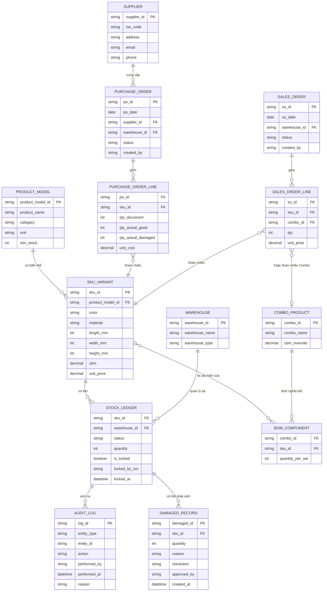
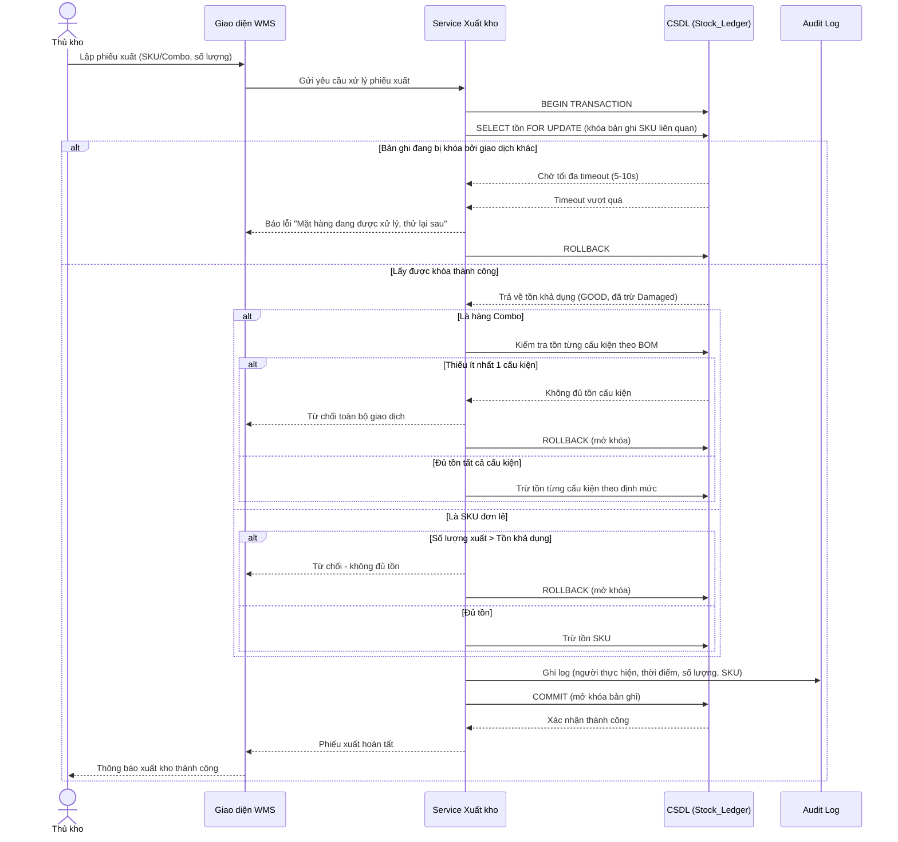
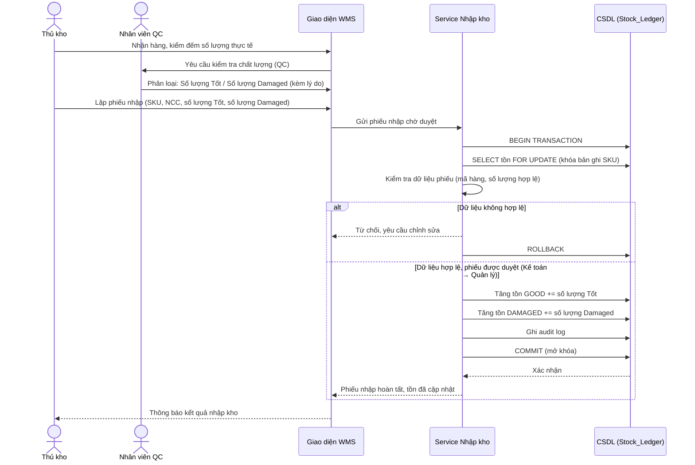
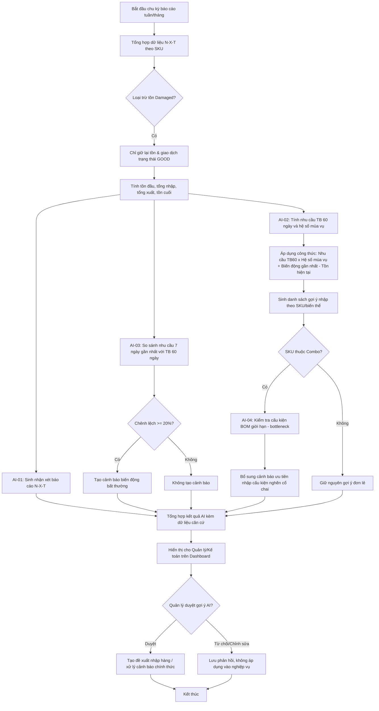
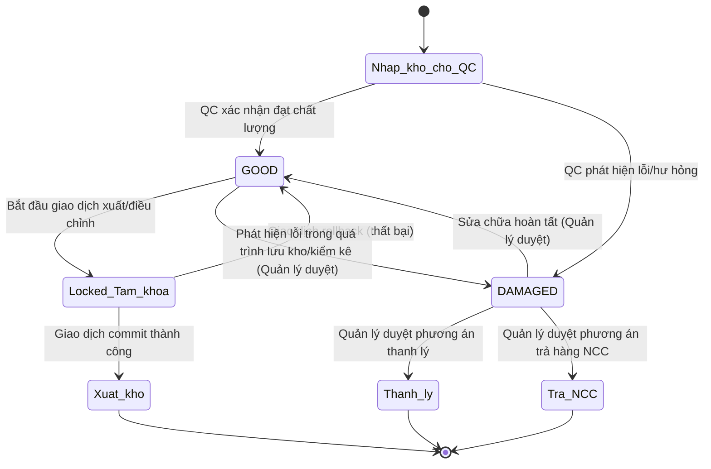

# HỆ THỐNG QUẢN LÝ KHO NỘI THẤT CÓ TÍCH HỢP AI – NHÓM 05
## ĐẶC TẢ YÊU CẦU ỨNG DỤNG – V2.0 (Cập nhật chuyên biệt hóa cho ngành Nội thất)

> Tài liệu đặc tả yêu cầu người dùng – phiên bản 2.0. Kế thừa toàn bộ nội dung đã chốt tại URD v1.1 (16 điểm TBC), đồng thời bổ sung logic nghiệp vụ đặc thù ngành **Nội thất**: thuộc tính kích thước (CBM), hàng Combo/BOM, biến thể SKU, trạng thái hàng lỗi/damaged, và cơ chế khóa bản ghi tồn kho (Pessimistic Locking).

| Thông tin | Giá trị |
|---|---|
| Mã tài liệu | URD-WMS-AI-002 |
| Phiên bản | 2.0 – Bổ sung nghiệp vụ Kho Nội thất |
| Nguồn đầu vào | URD-WMS-AI-001 (v1.1) + Yêu cầu bổ sung nghiệp vụ Nội thất |
| Phạm vi | Quản lý hàng hóa (kèm CBM, Combo/BOM, biến thể SKU), NCC, nhập, xuất, tồn (kèm trạng thái Damaged), cảnh báo, lịch sử, báo cáo, phân quyền, AI, khóa đồng thời |
| Trạng thái | Đã chốt nghiệp vụ – cơ sở phát triển SRS |

### Nguyên tắc xây dựng
Tài liệu này giữ nguyên toàn bộ cấu trúc và nội dung đã chốt của URD v1.1, đồng thời **bổ sung** (không thay thế) các mục nghiệp vụ đặc thù ngành nội thất. Các nội dung mới được đánh dấu **[MỚI – NỘI THẤT]** để dễ đối chiếu với bản gốc.

---

## MỤC LỤC
1. Tổng quan
2. Mục tiêu và phạm vi
3. Stakeholder và Actor
4. Bối cảnh hệ thống
5. Hiện trạng AS-IS
6. Nghiệp vụ TO-BE
7. Use Case
8. Business Rules
9. Yêu cầu chức năng
10. Yêu cầu AI
11. Yêu cầu phi chức năng
12. Mô hình dữ liệu nghiệp vụ
13. Báo cáo và đầu ra
14. Ma trận truy vết
15. Tiêu chí nghiệm thu cấp URD
16. Các điểm đã xác nhận và chốt
17. Phụ lục
18. **[MỚI – NỘI THẤT] Đặc tả nghiệp vụ chuyên biệt ngành Kho Nội thất**
19. **[MỚI – NỘI THẤT] Sơ đồ kỹ thuật (Mermaid.js): ERD, Sequence Diagram, Flowchart AI**

---

## 1. Tổng quan

Mục đích: chuyển kết quả khảo sát nghiệp vụ thành bộ yêu cầu người dùng có cấu trúc, đủ làm đầu vào cho SRS, dành riêng cho mô hình **kho hàng nội thất** (bàn, ghế, tủ, giường, sofa...). Tài liệu nguồn xác định trọng tâm là quản lý hàng hóa, nhập kho, xuất kho, tồn kho, cảnh báo tồn thấp, lịch sử giao dịch, báo cáo, phân quyền và ba hướng AI: sinh báo cáo/nhận xét, gợi ý nhập hàng, phát hiện biến động.

**[MỚI – NỘI THẤT]** Đặc thù ngành nội thất khiến hệ thống WMS thông thường không đủ đáp ứng, cụ thể:
- Hàng hóa có **kích thước vật lý lớn** (Dài x Rộng x Cao), cần quản lý thể tích (CBM) để tính diện tích lưu kho, tối ưu xe tải/công-te-nơ vận chuyển.
- Nhiều sản phẩm được bán theo **bộ/combo** (VD: Bộ bàn ăn 6 ghế), cấu thành từ nhiều cấu kiện (BOM – Bill of Materials), cần tách rời khi nhập và ghép bộ khi xuất.
- Một mã hàng gốc có thể có nhiều **biến thể (variant)** theo màu sắc, chất liệu (gỗ sồi/gỗ công nghiệp, bọc da/bọc nỉ...), mỗi biến thể là một SKU tồn kho riêng biệt.
- Hàng nội thất dễ phát sinh **lỗi/trầy xước trong quá trình vận chuyển, bốc dỡ**, cần một trạng thái tồn riêng để cách ly khỏi tồn khả dụng bán ra.
- Do giá trị đơn hàng lớn và nhiều nhân viên thao tác kho đồng thời, cần cơ chế **khóa bản ghi tồn kho (locking)** chặt chẽ hơn để tránh xuất vượt tồn khi có giao dịch chạy song song.

### 1.1. Tài liệu tham chiếu

| Nguồn | Vai trò |
|---|---|
| URD-WMS-AI-001 (v1.1) | Nguồn gốc – các nội dung chốt về nghiệp vụ WMS tổng quát |
| Yêu cầu bổ sung nghiệp vụ Nội thất (khảo sát mở rộng) | Cơ sở xây dựng mục 18–19 của tài liệu này |

### 1.2. Quy ước

| Ký hiệu | Ý nghĩa |
|---|---|
| REQ-F | Functional/User requirement |
| REQ-NF | Non-functional requirement |
| REQ-AI | AI requirement |
| BR | Business Rule |
| UC | Use Case |
| TBC | To Be Confirmed – cần xác nhận |
| AS-IS | Hiện trạng |
| TO-BE | Quy trình mục tiêu |
| CBM | Cubic Meter – thể tích tính bằng m³ |
| BOM | Bill of Materials – định mức cấu kiện của hàng Combo/Bộ |
| SKU | Stock Keeping Unit – mã hàng tồn kho duy nhất (đã gồm biến thể) |

---

## 2. Mục tiêu và phạm vi

### 2.1. Mục tiêu nghiệp vụ
- Giảm nhập dữ liệu lặp lại và sai lệch giữa các file.
- Tự động cập nhật tồn sau nghiệp vụ nhập/xuất.
- Không cho phép xuất vượt tồn và hạn chế tồn âm.
- Tự động cảnh báo hàng dưới mức tồn tối thiểu.
- Lưu lịch sử giao dịch/thao tác để truy vết.
- Tự động hóa báo cáo nhập–xuất–tồn.
- Hỗ trợ AI nhận xét báo cáo, gợi ý nhập hàng và phát hiện biến động.
- **[MỚI – NỘI THẤT]** Tự động tính thể tích (CBM) từ kích thước sản phẩm để hỗ trợ tối ưu không gian kho và vận chuyển.
- **[MỚI – NỘI THẤT]** Quản lý chính xác hàng Combo/BOM và biến thể SKU, tránh sai lệch tồn giữa cấu kiện lẻ và hàng bộ.
- **[MỚI – NỘI THẤT]** Cách ly hàng lỗi/hư hỏng nhẹ khỏi tồn khả dụng để tránh bán nhầm hàng lỗi cho khách.
- **[MỚI – NỘI THẤT]** Ngăn chặn triệt để tình trạng xuất vượt tồn khi nhiều giao dịch xử lý đồng thời trên cùng một mã hàng, thông qua khóa bản ghi tồn kho ở tầng CSDL.

### 2.2. Phạm vi trong URD

| Nhóm | Trong phạm vi |
|---|---|
| Danh mục | Hàng hóa (kèm kích thước/CBM, biến thể SKU), Combo/BOM, nhà cung cấp |
| Kho | Phiếu nhập, phiếu xuất, tồn kho (kèm trạng thái Damaged), kiểm soát tồn |
| Kiểm soát | Trạng thái phiếu, quyền, audit/history, khóa bản ghi tồn (locking) |
| Cảnh báo | Tồn dưới tồn tối thiểu, hàng lỗi phát sinh |
| Báo cáo | Nhập–xuất–tồn (phân tách theo trạng thái tồn); Excel/PDF |
| AI | Sinh báo cáo/nhận xét; gợi ý nhập; phát hiện biến động |

### 2.3. Ngoài phạm vi/chưa đủ dữ liệu
Chưa đủ căn cứ để chốt: mô hình xử lý bảo hành/đổi trả hàng lỗi về NCC, quy trình sơn sửa/tái chế hàng Damaged, chính sách chiết khấu theo combo. Các điểm này được đưa vào mục 18.6 (TBC bổ sung) để xác nhận.

---

## 3. Stakeholder và Actor

| Actor | Vai trò nghiệp vụ | Quyền sơ bộ |
|---|---|---|
| Thủ kho | Thao tác nhập/xuất, kiểm kê, cập nhật/tra cứu tồn, theo dõi cảnh báo, **[MỚI]** đánh giá và gắn trạng thái hàng lỗi | Tạo phiếu nhập/xuất; sửa khi chưa duyệt |
| Kế toán | Kiểm tra, đối chiếu chứng từ và báo cáo | Kiểm tra/đối chiếu, duyệt phiếu |
| Quản lý | Kiểm soát cuối, báo cáo, **[MỚI]** duyệt xử lý hàng lỗi (thanh lý/trả NCC) | Duyệt cuối, hủy phiếu, xem báo cáo |
| Nhân viên | Lập chứng từ nháp | Chỉ tạo phiếu nháp; không duyệt/xóa |
| Nhà cung cấp | Nguồn giao hàng | Không phải người dùng hệ thống theo khảo sát; là đối tượng nghiệp vụ |
| **[MỚI]** Nhân viên đóng gói/QC kho | Kiểm tra chất lượng hàng nội thất khi nhập, khi ghép Combo | Ghi nhận tình trạng cấu kiện, gắn cờ lỗi |

Tài liệu khảo sát xác định thủ kho là đối tượng trọng tâm; vai trò và quyền được ghi nhận ở mức sơ bộ.

---

## 4. Bối cảnh hệ thống

Sơ đồ thể hiện các actor nghiệp vụ và các nhóm tương tác chính được khảo sát; không coi Nhà cung cấp là user hệ thống nếu chưa có xác nhận. Xem sơ đồ chi tiết (Mermaid) tại mục 19.1.

### 4.1. Giả định và ràng buộc từ khảo sát
- Dữ liệu hiện tại chủ yếu được thao tác bằng Excel.
- Tồn cuối kỳ được xác định theo công thức: **Tồn cuối = Tồn đầu + Nhập – Xuất**.
- Cập nhật tồn cần thực hiện nhất quán trong cùng transaction CSDL để tránh sai số khi giao dịch đồng thời.
- Lịch sử cần phục vụ truy vết và kiểm toán; khảo sát đề xuất tối thiểu 2–3 năm nhưng thời hạn chính thức đã được chốt là 5 năm (xem mục 16).
- **[MỚI – NỘI THẤT]** Tồn kho khả dụng để xuất bán = Tổng tồn vật lý **trừ** tồn ở trạng thái Damaged/Lỗi nhẹ và trừ tồn đang bị khóa bởi giao dịch khác (xem mục 18.3, 18.4).
- **[MỚI – NỘI THẤT]** Tồn của hàng Combo là tồn **suy diễn (derived)** từ tồn cấu kiện theo BOM, không lưu trực tiếp như hàng đơn lẻ (xem mục 18.2).

---

## 5. Hiện trạng AS-IS

### 5.1. Nhập kho
Nhận hàng → Kiểm đếm → Đối chiếu chứng từ → Ghi Excel → Cập nhật tồn. Ví dụ khảo sát: chứng từ ghi 50 bàn phím nhưng thực tế 48, nhân viên phải ghi nhận sai lệch và báo bộ phận liên quan.

**[MỚI – NỘI THẤT]** Với hàng nội thất, thực tế khảo sát bổ sung: khi bốc dỡ container/xe tải, nhân viên phát hiện ván gỗ bị trầy, mặt kính bị nứt nhưng vẫn phải ghi nhận nhập kho vì hàng đã về, dẫn đến hàng lỗi bị trộn lẫn tồn kho tốt trên cùng một dòng Excel, gây khó khăn khi xuất bán (khách nhận hàng lỗi).

### 5.2. Cập nhật tồn
Nhân viên ghi số lượng nhập trên một bảng tính rồi mở bảng khác để cập nhật tồn, gây nguy cơ nhập sai, quên cập nhật, nhầm mã, không thống nhất và khó truy vết người sửa.

### 5.3. Xuất kho
Nhân viên kiểm tra tồn trên file trước khi xuất; khảo sát ghi nhận nguy cơ xuất vượt tồn khi nhiều người cùng cập nhật. Quy tắc: số lượng xuất phải nhỏ hơn hoặc bằng số lượng tồn.

**[MỚI – NỘI THẤT]** Với hàng Combo (VD: bộ bàn ăn), nhân viên phải kiểm tra thủ công tồn của từng cấu kiện (mặt bàn, chân bàn, 6 ghế) trước khi xuất, dễ xuất thiếu/dư cấu kiện do không có công cụ kiểm tra tự động.

### 5.4. Tồn thấp và báo cáo
Tồn thấp hiện được phát hiện thủ công; báo cáo cuối tháng cần lọc Excel, tổng hợp tồn đầu, nhập, xuất, tồn cuối và tự viết nhận xét.

| Vấn đề | Tác động | Định hướng URD |
|---|---|---|
| Nhập dữ liệu nhiều lần | Sai lệch, tăng thao tác | Tự động cập nhật tồn |
| Sai số/mã hàng | Tồn không chính xác | Kiểm tra dữ liệu/đối chiếu |
| Khó truy vết | Khó tìm nguyên nhân | Audit/history |
| Nguy cơ tồn âm | Ảnh hưởng xuất | Chặn xuất vượt tồn |
| Khó phát hiện hàng sắp hết | Bỏ sót nhập | Cảnh báo tự động |
| Báo cáo thủ công | Tốn thời gian | Báo cáo tự động |
| Khó phát hiện biến động | Chậm nhận biết | AI phân tích |
| Khó quyết định nhập bao nhiêu | Phụ thuộc đánh giá thủ công | AI gợi ý |
| **[MỚI]** Hàng lỗi lẫn vào tồn tốt | Bán nhầm hàng lỗi cho khách | Trạng thái tồn Damaged riêng biệt |
| **[MỚI]** Kiểm tồn Combo thủ công | Xuất thiếu/dư cấu kiện | Tồn Combo tự tính từ BOM |
| **[MỚI]** Nhiều người thao tác cùng SKU | Xuất vượt tồn khi tranh chấp bản ghi | Pessimistic Locking |

---

## 6. Nghiệp vụ TO-BE

### 6.1. Luồng nhập kho
Nhập kho gồm: kiểm tra → ghi số thực tế → **[MỚI] QC phân loại Tốt/Damaged** → lập/duyệt phiếu → cập nhật tồn theo đúng trạng thái → lưu lịch sử. Xem sequence diagram chi tiết tại mục 19.2.

### 6.2. Luồng xuất kho
Xuất kho gồm: chọn mặt hàng/biến thể → **[MỚI] khóa bản ghi tồn (lock)** → kiểm tra tồn khả dụng (loại trừ Damaged) → nếu là Combo thì kiểm tra tồn tất cả cấu kiện theo BOM → lập phiếu → duyệt → giảm tồn → **[MỚI] mở khóa (unlock)** → lưu lịch sử; từ chối nếu không đủ tồn. Xem sequence diagram chi tiết tại mục 19.2.

### 6.3. Báo cáo và AI
Báo cáo đi qua thống kê rồi AI phân tích. **[MỚI – NỘI THẤT]** Dữ liệu thống kê tách riêng tồn Tốt và tồn Damaged; AI chỉ dùng tồn khả dụng (Tốt) để tính gợi ý nhập và phát hiện biến động, tránh gợi ý sai do hàng lỗi làm giảm ảo số liệu xuất bán.

---

## 7. Use Case

| ID | Use Case | Actor chính | Mục tiêu |
|---|---|---|---|
| UC-01 | Quản lý hàng hóa | Thủ kho/Quản lý | Duy trì danh mục hàng hóa |
| UC-02 | Quản lý nhà cung cấp | Thủ kho/Quản lý | Duy trì NCC |
| UC-03 | Lập phiếu nhập | Thủ kho/Nhân viên | Ghi nhận hàng thực nhập |
| UC-04 | Lập phiếu xuất | Thủ kho/Nhân viên | Ghi nhận xuất theo yêu cầu |
| UC-05 | Kiểm soát tồn | Thủ kho | Đảm bảo tồn nhất quán |
| UC-06 | Cảnh báo tồn thấp | Thủ kho/Quản lý | Phát hiện hàng dưới ngưỡng |
| UC-07 | Tra cứu lịch sử | Thủ kho/Kế toán/Quản lý | Truy vết giao dịch/thao tác |
| UC-08 | Báo cáo N-X-T | Kế toán/Quản lý | Theo dõi tồn đầu/nhập/xuất/tồn cuối |
| UC-09 | Xuất Excel/PDF | Kế toán/Quản lý | Xuất báo cáo |
| UC-10 | AI sinh báo cáo | Quản lý/Kế toán | Nhận báo cáo kèm nhận xét |
| UC-11 | AI gợi ý nhập | Quản lý | Ưu tiên mặt hàng và lượng nhập |
| UC-12 | AI phát hiện biến động | Quản lý | Nhận diện tăng/giảm đáng kể |
| UC-13 | Phân quyền | Quản lý | Kiểm soát thao tác theo vai trò |
| **UC-14** [MỚI] | Quản lý kích thước & tính CBM | Thủ kho/Quản lý | Tự động tính thể tích hàng hóa |
| **UC-15** [MỚI] | Quản lý Combo/BOM | Quản lý | Định nghĩa cấu kiện cho hàng bộ |
| **UC-16** [MỚI] | Quản lý biến thể SKU | Quản lý | Quản lý các biến thể màu sắc/chất liệu |
| **UC-17** [MỚI] | Ghi nhận & xử lý hàng lỗi (Damaged) | Thủ kho/QC/Quản lý | Cách ly hàng lỗi khỏi tồn khả dụng |
| **UC-18** [MỚI] | Khóa bản ghi tồn kho khi giao dịch | Hệ thống | Ngăn xuất vượt tồn do tranh chấp đồng thời |

### 7.1. Đặc tả Use Case trọng tâm

**UC-03 – Lập phiếu nhập**

| Mục | Đặc tả |
|---|---|
| Actor | Thủ kho/Nhân viên |
| Tiền điều kiện | Có hàng giao; mã hàng hợp lệ |
| Luồng chính | Nhận hàng → kiểm đếm → đối chiếu → nhập số thực tế → **[MỚI] QC phân loại từng đơn vị hàng: Tốt/Damaged** → lập phiếu → duyệt theo quyền → tăng tồn theo đúng trạng thái → lưu lịch sử |
| Ngoại lệ/điểm mở | Nếu số thực tế khác chứng từ: lưu số thực tế và sai lệch; nếu dữ liệu không hợp lệ: không hoàn tất |
| Hậu điều kiện | Phiếu có trạng thái; tồn Tốt và tồn Damaged được cập nhật riêng biệt nếu xử lý thành công |

**UC-04 – Lập phiếu xuất**

| Mục | Đặc tả |
|---|---|
| Actor | Thủ kho/Nhân viên |
| Tiền điều kiện | Có yêu cầu xuất |
| Luồng chính | Chọn kho/mặt hàng/biến thể → **[MỚI] hệ thống khóa (lock) bản ghi tồn liên quan** → kiểm tra tồn khả dụng (không tính Damaged) → **[MỚI] nếu là Combo: kiểm tra tồn tất cả cấu kiện theo BOM** → lập phiếu → duyệt → giảm tồn → **[MỚI] mở khóa bản ghi** → lưu lịch sử |
| Ngoại lệ/điểm mở | Nếu không đủ tồn (kể cả thiếu 1 cấu kiện của Combo): từ chối toàn bộ giao dịch |
| Hậu điều kiện | Không phát sinh tồn âm; không có bản ghi tồn nào bị khóa treo sau khi giao dịch kết thúc |

**UC-06 – Cảnh báo tồn thấp**

| Mục | Đặc tả |
|---|---|
| Actor | Hệ thống + Thủ kho |
| Tiền điều kiện | Có tồn khả dụng và tồn tối thiểu |
| Luồng chính | So sánh tồn khả dụng (Tốt) với tồn tối thiểu → tạo/hiển thị cảnh báo |
| Ngoại lệ/điểm mở | Kênh thông báo: Dashboard + Email nội bộ cho Quản lý (đã chốt) |
| Hậu điều kiện | Danh sách hàng cần chú ý |

**UC-08 – Báo cáo N-X-T**

| Mục | Đặc tả |
|---|---|
| Actor | Kế toán/Quản lý |
| Tiền điều kiện | Có dữ liệu kỳ báo cáo |
| Luồng chính | Tổng hợp tồn đầu + nhập + xuất → tính tồn cuối (tách Tốt/Damaged) → hiển thị/xuất |
| Ngoại lệ/điểm mở | Lịch chạy: tuần/tháng (đã chốt) |
| Hậu điều kiện | Báo cáo sẵn sàng |

**UC-10 – AI sinh báo cáo**

| Mục | Đặc tả |
|---|---|
| Actor | Quản lý/Kế toán |
| Tiền điều kiện | Có dữ liệu thống kê (tồn khả dụng) |
| Luồng chính | Gửi dữ liệu N-X-T → AI tạo nhận xét → trả báo cáo kèm nhận xét |
| Ngoại lệ/điểm mở | Người dùng có thể phản hồi/điều chỉnh nhận xét AI trong SRS |
| Hậu điều kiện | Có nội dung AI và dữ liệu nền |

**UC-11 – AI gợi ý nhập**

| Mục | Đặc tả |
|---|---|
| Actor | Quản lý |
| Tiền điều kiện | Có tồn khả dụng, tồn tối thiểu, dữ liệu xuất |
| Luồng chính | Phân tích nhu cầu → đề xuất mặt hàng/biến thể → ưu tiên → gợi ý lượng nhập |
| Ngoại lệ/điểm mở | Công thức đã chốt tại mục 10/16 |
| Hậu điều kiện | Có danh sách gợi ý; Quản lý phải duyệt trước khi áp dụng |

**UC-12 – AI phát hiện biến động**

| Mục | Đặc tả |
|---|---|
| Actor | Quản lý |
| Tiền điều kiện | Có dữ liệu xuất theo kỳ |
| Luồng chính | Phân tích tăng/giảm → nhận diện biến động → gợi ý kiểm tra nguyên nhân |
| Ngoại lệ/điểm mở | Ngưỡng đã chốt: ≥20%/7 ngày so với TB 60 ngày |
| Hậu điều kiện | Có cảnh báo/nhận xét |

**UC-14 [MỚI] – Quản lý kích thước & tính CBM**

| Mục | Đặc tả |
|---|---|
| Actor | Thủ kho/Quản lý |
| Tiền điều kiện | Có thông tin Dài (mm), Rộng (mm), Cao (mm) của sản phẩm |
| Luồng chính | Nhập/cập nhật kích thước → hệ thống tự động tính CBM = (Dài × Rộng × Cao) / 1.000.000.000 (m³) → lưu vào hồ sơ hàng hóa |
| Ngoại lệ/điểm mở | Nếu thiếu 1 trong 3 chiều: không cho phép lưu; đơn vị đo mặc định mm, có thể chuyển đổi hiển thị sang cm/m |
| Hậu điều kiện | CBM/đơn vị và tổng CBM tồn kho theo mã hàng luôn sẵn sàng cho báo cáo diện tích/khối kho, tối ưu xếp container |

**UC-15 [MỚI] – Quản lý Combo/BOM**

| Mục | Đặc tả |
|---|---|
| Actor | Quản lý |
| Tiền điều kiện | Các mã hàng cấu kiện đã tồn tại trong danh mục |
| Luồng chính | Tạo mã Combo (VD: "Bộ bàn ăn 6 ghế – Gỗ sồi") → định nghĩa danh sách cấu kiện & số lượng mỗi cấu kiện (BOM) → hệ thống tính CBM Combo = tổng CBM cấu kiện (hoặc CBM đóng gói riêng nếu khai báo) |
| Ngoại lệ/điểm mở | Không cho lưu BOM nếu cấu kiện không tồn tại hoặc số lượng ≤ 0 |
| Hậu điều kiện | Combo sẵn sàng để lập phiếu xuất; tồn Combo được suy diễn tự động từ tồn cấu kiện |

**UC-16 [MỚI] – Quản lý biến thể SKU**

| Mục | Đặc tả |
|---|---|
| Actor | Quản lý |
| Tiền điều kiện | Có mã hàng gốc (Product Model) |
| Luồng chính | Chọn mã hàng gốc → khai báo các thuộc tính biến thể (màu sắc, chất liệu, kích cỡ) → hệ thống sinh mã SKU riêng cho từng tổ hợp biến thể → mỗi SKU có tồn kho, giá, CBM riêng |
| Ngoại lệ/điểm mở | Trùng tổ hợp biến thể: hệ thống cảnh báo và không cho tạo trùng SKU |
| Hậu điều kiện | Danh sách SKU biến thể sẵn sàng cho nhập/xuất/tồn/báo cáo độc lập |

**UC-17 [MỚI] – Ghi nhận & xử lý hàng lỗi (Damaged)**

| Mục | Đặc tả |
|---|---|
| Actor | Thủ kho/QC/Quản lý |
| Tiền điều kiện | Phát hiện hàng lỗi/hư hỏng khi nhập, lưu kho, hoặc kiểm kê |
| Luồng chính | Ghi nhận số lượng & lý do lỗi → chuyển trạng thái tồn của số lượng đó từ "Tốt" sang "Damaged/Lỗi nhẹ" → **tồn khả dụng để xuất bán giảm tương ứng, tổng tồn vật lý không đổi** → Quản lý duyệt phương án xử lý (thanh lý, trả NCC, sửa chữa) |
| Ngoại lệ/điểm mở | Phương án xử lý cụ thể (trả NCC/thanh lý) chi tiết hóa tại SRS (xem TBC-17, mục 18.6) |
| Hậu điều kiện | Tồn Damaged tách biệt hoàn toàn khỏi tồn khả dụng trong mọi truy vấn xuất kho và báo cáo bán hàng |

**UC-18 [MỚI] – Khóa bản ghi tồn kho khi giao dịch (Pessimistic Locking)**

| Mục | Đặc tả |
|---|---|
| Actor | Hệ thống |
| Tiền điều kiện | Có giao dịch nhập/xuất/điều chỉnh/chuyển kho tác động đến bản ghi tồn của một SKU |
| Luồng chính | Giao dịch A yêu cầu xử lý SKU X → hệ thống khóa (SELECT ... FOR UPDATE) bản ghi tồn của SKU X → giao dịch A thực hiện kiểm tra & cập nhật tồn → commit → mở khóa. Nếu giao dịch B yêu cầu cùng SKU X trong lúc đang khóa → giao dịch B phải chờ (hoặc bị timeout/từ chối theo cấu hình) |
| Ngoại lệ/điểm mở | Timeout khóa tối đa: TBC ở SRS (đề xuất 5–10 giây); vượt timeout → báo lỗi "Bản ghi đang được xử lý, vui lòng thử lại" |
| Hậu điều kiện | Không có 2 giao dịch cùng lúc làm giảm tồn của cùng 1 SKU vượt quá tồn thực tế |

---

## 8. Business Rules

| ID | Quy tắc | Diễn giải |
|---|---|---|
| BR-01 | Số lượng xuất ≤ số lượng tồn khả dụng. | Không cho phép lập/hoàn tất giao dịch xuất vượt tồn khả dụng (đã loại trừ Damaged). |
| BR-02 | Tồn không được âm. | Mọi cập nhật xuất phải kiểm tra tồn trong cùng giao dịch có khóa. |
| BR-03 | Phiếu có trạng thái Nháp/Đã duyệt/Hủy. | Chuyển trạng thái phải theo quyền. |
| BR-04 | Sửa/hủy phiếu bị giới hạn theo trạng thái. | Nếu đã cập nhật tồn, hủy phải điều chỉnh tồn ngược lại. |
| BR-05 | Tồn thấp khi tồn khả dụng < tồn tối thiểu. | Tạo cảnh báo cho mặt hàng cần nhập. |
| BR-06 | Tồn cuối = Tồn đầu + Nhập – Xuất. | Áp dụng riêng cho từng trạng thái tồn (Tốt/Damaged); dùng cho báo cáo N-X-T. |
| BR-07 | Cập nhật tồn và giao dịch cần nhất quán trong transaction CSDL. | Giảm rủi ro sai số khi thao tác đồng thời. |
| BR-08 | Lưu lịch sử thao tác/giao dịch. | Phải truy được người, thời điểm và giao dịch liên quan. |
| BR-09 | Ngưỡng AI bất thường và công thức dự báo. | Đã chốt tại mục 10/16. |
| **BR-10** [MỚI] | CBM = (Dài × Rộng × Cao)/1.000.000.000, đơn vị mm → m³. | Tự động tính lại mỗi khi cập nhật kích thước sản phẩm. |
| **BR-11** [MỚI] | Tồn Combo = MIN( floor(Tồn cấu kiện[i] / Định mức BOM[i]) ) với mọi cấu kiện i thuộc BOM. | Không lưu tồn Combo trực tiếp; luôn tính động (derived) tại thời điểm truy vấn/xuất. |
| **BR-12** [MỚI] | Xuất hàng Combo chỉ thành công khi TẤT CẢ cấu kiện trong BOM đủ tồn khả dụng theo đúng định mức; nếu thiếu dù chỉ 1 cấu kiện, từ chối toàn bộ giao dịch. | Tránh xuất bộ bàn ghế thiếu ghế. |
| **BR-13** [MỚI] | Mỗi biến thể (màu sắc, chất liệu...) là một SKU tồn kho độc lập, có tồn/CBM/giá riêng, không được gộp tồn giữa các biến thể của cùng 1 mã hàng gốc. | Đảm bảo tồn theo đúng biến thể thực tế trong kho. |
| **BR-14** [MỚI] | Số lượng ở trạng thái "Damaged/Lỗi nhẹ" bị loại trừ hoàn toàn khỏi Tồn khả dụng dùng cho: xuất bán, cảnh báo tồn thấp, AI gợi ý nhập, AI phát hiện biến động. | Tồn khả dụng = Tồn vật lý − Tồn Damaged − Tồn đang bị khóa bởi giao dịch khác chưa commit. |
| **BR-15** [MỚI] | Chuyển trạng thái từ Damaged sang Tốt (sau khi sửa chữa) hoặc từ Tốt sang Damaged đều phải được Quản lý duyệt và ghi log lý do. | Đảm bảo kiểm soát/không lạm dụng để gian lận tồn kho. |
| **BR-16** [MỚI] | Mọi giao dịch làm thay đổi tồn (nhập/xuất/điều chỉnh/chuyển kho/đổi trạng thái Damaged) phải khóa bản ghi tồn liên quan (Pessimistic Locking – `SELECT ... FOR UPDATE`) trong suốt thời gian xử lý và chỉ mở khóa sau khi commit hoặc rollback. | Ngăn 2 giao dịch đồng thời cùng đọc tồn cũ rồi cùng ghi đè, gây xuất vượt tồn. |

---

## 9. Yêu cầu chức năng

| ID | Tên | Mô tả yêu cầu người dùng |
|---|---|---|
| REQ-F-01 | Quản lý hàng hóa | Hệ thống cho phép quản lý mã hàng, tên hàng, đơn vị tính và thông tin phục vụ nhập/xuất/tồn. |
| REQ-F-02 | Quản lý nhà cung cấp | Hệ thống cho phép quản lý thông tin NCC và liên kết NCC với nhập kho. |
| REQ-F-03 | Phiếu nhập | Cho phép lập phiếu với số phiếu, ngày nhập, NCC, kho nhận, hàng hóa, số lượng thực nhập, đơn giá, thành tiền, người lập, trạng thái. |
| REQ-F-04 | Sai lệch nhập | Cho phép ghi nhận số lượng thực tế khác chứng từ. |
| REQ-F-05 | Kiểm tra dữ liệu | Kiểm tra mã hàng và dữ liệu phiếu trước xử lý. |
| REQ-F-06 | Cập nhật tồn nhập | Sau khi phiếu nhập xử lý thành công, tự động tăng tồn theo đúng trạng thái (Tốt/Damaged). |
| REQ-F-07 | Phiếu xuất | Cho phép lập phiếu với số phiếu, ngày xuất, kho xuất, đơn vị nhận, hàng hóa/biến thể/Combo, số lượng, đơn giá nếu cần, thành tiền, người lập, trạng thái. |
| REQ-F-08 | Chặn vượt tồn | Không cho phép hoàn tất xuất nếu số lượng vượt tồn khả dụng. |
| REQ-F-09 | Cảnh báo tồn thấp | Tự động xác định hàng có tồn khả dụng dưới tồn tối thiểu và tạo cảnh báo. |
| REQ-F-10 | Lịch sử | Lưu lịch sử nhập/xuất và thao tác, phục vụ truy vết. |
| REQ-F-11 | Báo cáo N-X-T | Cung cấp tồn đầu, tổng nhập, tổng xuất, tồn cuối, tách theo trạng thái Tốt/Damaged. |
| REQ-F-12 | Xuất báo cáo | Hỗ trợ xuất Excel/PDF theo khảo sát. |
| REQ-F-13 | Phân quyền | Kiểm soát tạo/sửa/duyệt/hủy/xem theo vai trò. |
| REQ-F-14 | Tra cứu | Cho phép tra cứu lịch sử theo tiêu chí nghiệp vụ, bao gồm lọc theo trạng thái tồn, biến thể, Combo. |
| REQ-F-15 | Quản lý trạng thái | Hỗ trợ Nháp/Đã duyệt/Hủy. |
| REQ-F-16 | Quản lý lô hàng và hạn sử dụng | Kế thừa từ v1.1; áp dụng cho nhóm hàng nội thất có lớp phủ/sơn có hạn bảo quản (nếu có). |
| REQ-F-17 | Chuyển kho nội bộ | Chuyển kho giữa kho chính và kho chi nhánh, cập nhật CBM tồn theo từng kho. |
| REQ-F-18 | Kiểm kê định kỳ | Lập và xử lý phiếu kiểm kê hàng quý, tách riêng kiểm đếm hàng Tốt và Damaged. |
| REQ-F-19 | Điều chỉnh tồn | Lập phiếu điều chỉnh tồn khi sai lệch kiểm kê >5% hoặc khi sửa/hủy phiếu đã duyệt. |
| REQ-F-20 | Workflow duyệt | 2 cấp Kế toán → Quản lý; cấp Giám đốc cho phiếu xuất >100 triệu. |
| REQ-F-21 | Tra cứu/lọc báo cáo | Theo tuần/tháng, theo NCC, mặt hàng, biến thể, kho, trạng thái tồn. |
| REQ-F-22 | Cảnh báo email | Gửi email nội bộ cảnh báo tồn thấp cho Quản lý. |
| REQ-F-23 | Khóa bản ghi tồn | **[Cập nhật – NỘI THẤT]** Áp dụng cơ chế Pessimistic Locking (`SELECT ... FOR UPDATE`) khi có giao dịch nhập/xuất/điều chỉnh/chuyển kho/đổi trạng thái Damaged tác động đến một SKU; timeout và cơ chế retry đặc tả chi tiết ở SRS. |
| REQ-F-24 | Audit log | Lưu audit log 5 năm với lý do thao tác. |
| REQ-F-25 | Quản lý nhà cung cấp mở rộng | Mã số thuế, địa chỉ, email, số điện thoại, lịch sử giao dịch. |
| REQ-F-26 | Duyệt gợi ý AI | Quản lý duyệt gợi ý AI trước khi áp dụng vào nghiệp vụ. |
| **REQ-F-27** [MỚI] | Quản lý kích thước & CBM | Cho phép nhập/sửa Dài, Rộng, Cao (mm) theo từng SKU; hệ thống tự động tính và hiển thị CBM (m³); tổng hợp CBM tồn kho theo kho/khu vực. |
| **REQ-F-28** [MỚI] | Quản lý Combo/BOM | Cho phép tạo mã hàng loại "Combo", định nghĩa danh sách cấu kiện & định mức số lượng (BOM); tự tính tồn Combo suy diễn theo BR-11; validate đủ cấu kiện khi xuất theo BR-12. |
| **REQ-F-29** [MỚI] | Quản lý biến thể SKU | Cho phép khai báo thuộc tính biến thể (màu sắc, chất liệu, kích cỡ...) trên mã hàng gốc; tự sinh SKU con cho mỗi tổ hợp biến thể; mỗi SKU con quản lý tồn/giá/CBM độc lập. |
| **REQ-F-30** [MỚI] | Ghi nhận trạng thái hàng lỗi (Damaged) | Cho phép Thủ kho/QC gắn cờ Damaged/Lỗi nhẹ cho một số lượng cụ thể của SKU kèm lý do & hình ảnh minh chứng (tùy chọn); tự động loại trừ số lượng này khỏi tồn khả dụng; yêu cầu Quản lý duyệt việc chuyển trạng thái. |
| **REQ-F-31** [MỚI] | Xử lý hàng Damaged | Cho phép Quản lý chọn phương án xử lý hàng Damaged: chuyển về Tốt (đã sửa), thanh lý, hoặc trả lại NCC; mỗi phương án tạo bút toán điều chỉnh tồn tương ứng. |
| **REQ-F-32** [MỚI] | Cấu hình timeout khóa | Cho phép Quản trị hệ thống cấu hình thời gian chờ khóa (lock timeout) và số lần retry khi giao dịch bị chặn bởi Pessimistic Locking. |

---

## 10. Yêu cầu AI

| ID | Nhóm | Input | Output mong muốn | Tình trạng |
|---|---|---|---|---|
| REQ-AI-01 | Sinh báo cáo | Dữ liệu nhập/xuất/tồn (chỉ tính tồn khả dụng) | Báo cáo N-X-T kèm nhận xét | Đã xác định |
| REQ-AI-02 | Gợi ý nhập | Tồn khả dụng, tồn tối thiểu, dữ liệu xuất, nhu cầu dự báo | Mặt hàng/biến thể nên nhập và mức độ ưu tiên | Đã xác định |
| REQ-AI-03 | Phát hiện biến động | Số liệu xuất theo các kỳ (chỉ tính hàng Tốt xuất bán, loại trừ Damaged) | Nhận xét tăng/giảm đáng kể và gợi ý kiểm tra nguyên nhân | Đã xác định |
| **REQ-AI-04** [MỚI] | Gợi ý nhập theo cấu kiện Combo | Tồn cấu kiện, BOM, tốc độ bán Combo | Cảnh báo "cấu kiện nghẽn cổ chai" (bottleneck component) làm giới hạn khả năng ghép Combo, kèm gợi ý ưu tiên nhập cấu kiện đó | Mới bổ sung – công thức chi tiết ở SRS |

Yêu cầu AI đã được chốt: phát hiện biến động bất thường khi nhu cầu tăng/giảm ≥20% trong 7 ngày liên tiếp so với trung bình 60 ngày; dự báo sử dụng nhu cầu trung bình 60 ngày, hệ số mùa vụ và biến động gần nhất. Hệ số mùa vụ: 1,2 cho tháng cao điểm và 0,8 cho tháng thấp điểm.

### 10.1. Nguyên tắc kiểm soát AI
- AI chỉ đưa ra nhận xét/gợi ý dựa trên dữ liệu nghiệp vụ được cung cấp, **và chỉ trên phần tồn khả dụng (đã loại trừ Damaged)**.
- Kết quả AI cần hiển thị cùng dữ liệu/thời kỳ làm căn cứ để người dùng kiểm tra.
- Kết quả gợi ý AI không được tự động áp dụng vào nghiệp vụ. Quản lý phải thực hiện chức năng "Duyệt gợi ý AI" trước khi hệ thống tạo/áp dụng đề xuất nhập hàng hoặc xử lý cảnh báo theo quy trình.
- **[MỚI]** Với hàng Combo, AI phải cảnh báo rõ khi gợi ý nhập bị giới hạn bởi 1 cấu kiện cụ thể (bottleneck), tránh gợi ý nhập chung chung không khả thi.

---

## 11. Yêu cầu phi chức năng

| ID | Nhóm | Yêu cầu URD | Mức xác định |
|---|---|---|---|
| REQ-NF-01 | Tính nhất quán dữ liệu | Cập nhật tồn phải nhất quán trong transaction CSDL. | Đã xác định ở mức nghiệp vụ/kỹ thuật |
| REQ-NF-02 | Phân quyền | Thao tác phải tuân theo vai trò. | Đã xác định |
| REQ-NF-03 | Audit/Traceability | Lưu người thực hiện, thời điểm, giao dịch liên quan. | Đã xác định |
| REQ-NF-04 | Lưu trữ | Lịch sử phục vụ kiểm toán; lưu 5 năm. | Đã chốt |
| REQ-NF-05 | Định dạng đầu ra | Báo cáo hỗ trợ Excel/PDF. | Đã xác định |
| REQ-NF-06 | Đồng thời | Ngăn sai số do nhiều người cùng thao tác tồn. | Đã đặc tả cơ chế – xem REQ-NF-07 |
| **REQ-NF-07** [MỚI] | Khóa bản ghi (Locking) | Áp dụng Pessimistic Locking (`SELECT ... FOR UPDATE`) ở tầng CSDL cho mọi bản ghi tồn kho bị tác động bởi giao dịch nhập/xuất/điều chỉnh/Damaged; timeout khóa đề xuất 5–10 giây; quá thời gian phải trả lỗi rõ ràng cho người dùng thay vì treo hệ thống. | Cần đặc tả kỹ thuật chi tiết ở SRS |
| **REQ-NF-08** [MỚI] | Hiệu năng tính CBM | Việc tự động tính CBM khi cập nhật kích thước hoặc tồn kho không được làm chậm thao tác nhập/xuất quá 1 giây/giao dịch (ràng buộc mức nghiệp vụ, sẽ lượng hóa kỹ thuật ở SRS). | Cần đặc tả kỹ thuật ở SRS |

Các yêu cầu hiệu năng, availability, backup, mã hóa, logging kỹ thuật, DR, SLA… chưa xuất hiện đủ trong tài liệu khảo sát nên không tự bổ sung thành yêu cầu bắt buộc trong URD, ngoại trừ các mục đã nêu ở trên liên quan trực tiếp đến locking và CBM.

---

## 12. Mô hình dữ liệu nghiệp vụ

Các thực thể dưới đây được suy ra trực tiếp từ trường dữ liệu phiếu nhập/xuất, hàng hóa, tồn và lịch sử trong khảo sát, **mở rộng thêm các thực thể đặc thù ngành nội thất**. Đây là mô hình nghiệp vụ sơ bộ, không phải thiết kế CSDL vật lý. Sơ đồ ERD chi tiết dạng Mermaid xem tại mục 19.1.

| Đối tượng | Thuộc tính chính được khảo sát |
|---|---|
| Hàng hóa (Product Model) | Mã hàng gốc, tên hàng, đơn vị tính, tồn tối thiểu |
| **[MỚI]** SKU (biến thể) | Mã SKU, mã hàng gốc, màu sắc, chất liệu, Dài/Rộng/Cao (mm), CBM (m³), tồn Tốt, tồn Damaged |
| **[MỚI]** Combo/BOM | Mã Combo, tên Combo, danh sách cấu kiện (SKU + định mức số lượng) |
| Nhà cung cấp | Mã số thuế, địa chỉ, email, số điện thoại, lịch sử giao dịch |
| Phiếu nhập | Số phiếu, ngày nhập, NCC, kho nhận, danh sách hàng (SKU), số lượng thực nhập, **[MỚI] số lượng phân loại Tốt/Damaged**, đơn giá, thành tiền, người lập, trạng thái |
| Phiếu xuất | Số phiếu, ngày xuất, kho xuất, đơn vị nhận, danh sách hàng (SKU/Combo), số lượng, đơn giá nếu cần, thành tiền, người lập, trạng thái |
| Tồn kho | SKU, kho, **[MỚI] trạng thái tồn (Tốt/Damaged)**, số lượng, **[MỚI] cờ khóa giao dịch (lock flag)** |
| Lịch sử | Người thực hiện, thời điểm, giao dịch liên quan, thao tác, **[MỚI] lý do đổi trạng thái Damaged (nếu có)** |

---

## 13. Báo cáo và đầu ra

| Báo cáo/đầu ra | Nội dung | Đối tượng |
|---|---|---|
| Báo cáo N-X-T | Tồn đầu kỳ, tổng nhập, tổng xuất, tồn cuối kỳ (tách Tốt/Damaged) | Kế toán/Quản lý |
| Excel/PDF | Định dạng xuất báo cáo | Kế toán/Quản lý |
| Cảnh báo tồn thấp | Mã hàng/SKU, tình trạng cần nhập | Thủ kho/Quản lý |
| AI nhận xét | Nhận xét trên dữ liệu N-X-T (tồn khả dụng) | Kế toán/Quản lý |
| AI gợi ý nhập | Mặt hàng/biến thể, ưu tiên, lượng gợi ý | Quản lý |
| AI biến động | Tăng/giảm đáng kể, gợi ý kiểm tra | Quản lý |
| **[MỚI]** Báo cáo hàng Damaged | Số lượng, giá trị, lý do lỗi, phương án xử lý theo kỳ | Quản lý |
| **[MỚI]** Báo cáo CBM/diện tích kho | Tổng CBM tồn theo kho/khu vực, hỗ trợ lập kế hoạch nhập hàng theo sức chứa | Thủ kho/Quản lý |
| **[MỚI]** Báo cáo cấu kiện nghẽn cổ chai (Combo) | Cấu kiện đang giới hạn khả năng ghép Combo | Quản lý |

Báo cáo được chốt theo tuần và tháng; hỗ trợ bộ lọc theo nhà cung cấp, mặt hàng, biến thể, kho và trạng thái tồn. Chi tiết định dạng file và layout báo cáo sẽ được đặc tả trong SRS.

---

## 14. Ma trận truy vết

| Nguồn khảo sát | Yêu cầu/artefact URD |
|---|---|
| Nhập dữ liệu nhiều lần | REQ-F-06, UC-03, BR-07 |
| Sai số số lượng/mã hàng | REQ-F-04, REQ-F-05, UC-03 |
| Khó truy vết | REQ-F-10, REQ-NF-03, UC-07 |
| Nguy cơ tồn âm | REQ-F-08, BR-01, BR-02, UC-04 |
| Khó phát hiện hàng sắp hết | REQ-F-09, UC-06 |
| Báo cáo thủ công | REQ-F-11, REQ-F-12, UC-08, UC-09 |
| Khó phát hiện biến động | REQ-AI-03, UC-12 |
| Khó quyết định nhập bao nhiêu | REQ-AI-02, UC-11 |
| Phân quyền chưa tốt | REQ-F-13, UC-13 |
| **[MỚI]** Hàng lỗi lẫn tồn tốt | REQ-F-30, REQ-F-31, BR-14, BR-15, UC-17 |
| **[MỚI]** Xuất vượt tồn do đồng thời | REQ-F-23, REQ-NF-07, BR-16, UC-18 |
| **[MỚI]** Khó quản lý kích thước/thể tích | REQ-F-27, BR-10, UC-14 |
| **[MỚI]** Khó quản lý hàng bộ/Combo | REQ-F-28, BR-11, BR-12, UC-15 |
| **[MỚI]** Khó quản lý biến thể màu/chất liệu | REQ-F-29, BR-13, UC-16 |

---

## 15. Tiêu chí nghiệm thu cấp URD

- Người dùng có thể lập phiếu nhập và ghi số lượng thực tế; sai lệch chứng từ được lưu.
- Phiếu nhập được xử lý thành công thì tồn tăng tương ứng, đúng trạng thái Tốt/Damaged.
- Người dùng không thể hoàn tất phiếu xuất vượt số lượng tồn khả dụng.
- Phiếu xuất được xử lý thành công thì tồn giảm tương ứng.
- Hàng dưới tồn tối thiểu được hệ thống xác định và cảnh báo.
- Có thể tra cứu lịch sử nhập/xuất và thao tác để truy vết.
- Báo cáo N-X-T thể hiện tồn đầu, nhập, xuất, tồn cuối và tuân thủ công thức nghiệp vụ.
- Có thể xuất báo cáo Excel/PDF theo phạm vi khảo sát.
- Quyền thao tác được phân vai: Nhân viên tạo phiếu nháp; Thủ kho lập nhập/xuất và kiểm kê; Kế toán duyệt sơ bộ và đối chiếu; Quản lý duyệt cuối, hủy phiếu và xem báo cáo; Giám đốc duyệt phiếu xuất >100 triệu.
- AI có ba (bốn, kể cả gợi ý cấu kiện Combo) nhóm đầu ra: nhận xét báo cáo, gợi ý nhập, phát hiện biến động, cảnh báo cấu kiện nghẽn cổ chai.
- **[MỚI]** Kích thước sản phẩm được nhập vào thì CBM được tự động tính chính xác và hiển thị ngay.
- **[MỚI]** Không thể xuất một Combo nếu thiếu bất kỳ cấu kiện nào theo BOM.
- **[MỚI]** Hai giao dịch xuất đồng thời trên cùng một SKU có tổng số lượng vượt tồn: chỉ một giao dịch được xử lý thành công, giao dịch còn lại bị từ chối hoặc phải chờ đến khi có đủ tồn.
- **[MỚI]** Số lượng hàng được gắn Damaged không xuất hiện trong tồn khả dụng và không được hệ thống gợi ý bán/xuất.

---

## 16. Các điểm đã xác nhận và chốt (kế thừa từ URD v1.1)

Toàn bộ 16 điểm TBC-01 đến TBC-16 tại URD v1.1 (workflow duyệt, số lượng kho, dữ liệu hàng hóa, kiểm kê, sửa/hủy sau duyệt, bất thường AI, dự báo AI, báo cáo, lưu trữ, cảnh báo, duyệt giá trị lớn, audit, đồng thời, phân vai, nhà cung cấp, AI human-in-the-loop) **được giữ nguyên hiệu lực** và bổ sung chi tiết kỹ thuật hóa tại mục 18 của tài liệu này (đặc biệt TBC-13 "Đồng thời" nay được cụ thể hóa bằng cơ chế Pessimistic Locking).

### 16.1. Bảng chốt bổ sung theo nghiệp vụ Nội thất

| ID | Chủ đề | Quyết định đã chốt |
|---|---|---|
| TBC-17 [MỚI] | Kích thước & CBM | Bắt buộc khai báo Dài, Rộng, Cao (mm) cho mọi SKU; CBM tự tính, hiển thị và dùng cho báo cáo diện tích kho. |
| TBC-18 [MỚI] | Combo/BOM | Combo được định nghĩa bằng danh sách cấu kiện + định mức; tồn Combo luôn suy diễn động, không lưu cứng. |
| TBC-19 [MỚI] | Biến thể SKU | Mỗi tổ hợp (màu sắc × chất liệu × kích cỡ) là 1 SKU tồn kho độc lập. |
| TBC-20 [MỚI] | Hàng Damaged | Trạng thái tồn "Damaged/Lỗi nhẹ" tách biệt hoàn toàn khỏi tồn khả dụng; xử lý (sửa/thanh lý/trả NCC) do Quản lý duyệt. |
| TBC-21 [MỚI] | Locking | Áp dụng Pessimistic Locking (`SELECT ... FOR UPDATE`) cho mọi giao dịch thay đổi tồn; timeout đề xuất 5–10 giây, cấu hình được. |

---

## 17. Phụ lục

### 17.1. Danh sách yêu cầu sơ bộ từ khảo sát (kế thừa)
- REQ-01 Quản lý hàng hóa
- REQ-02 Quản lý nhà cung cấp
- REQ-03 Lập phiếu nhập kho
- REQ-04 Ghi nhận số lượng thực tế khác chứng từ
- REQ-05 Kiểm tra mã hàng và dữ liệu phiếu
- REQ-06 Tự động cập nhật tồn kho
- REQ-07 Lập phiếu xuất kho
- REQ-08 Không cho phép xuất vượt tồn
- REQ-09 Cảnh báo tồn kho thấp
- REQ-10 Lưu lịch sử nhập/xuất và thao tác
- REQ-11 Báo cáo nhập–xuất–tồn
- REQ-12 Xuất báo cáo Excel/PDF
- REQ-13 Phân quyền theo vai trò
- REQ-14 AI sinh báo cáo và nhận xét
- REQ-15 AI gợi ý nhập hàng
- REQ-16 AI phát hiện biến động bất thường
- **REQ-17 [MỚI]** Quản lý kích thước & CBM
- **REQ-18 [MỚI]** Quản lý Combo/BOM
- **REQ-19 [MỚI]** Quản lý biến thể SKU
- **REQ-20 [MỚI]** Ghi nhận & xử lý hàng lỗi (Damaged)
- **REQ-21 [MỚI]** Khóa bản ghi tồn kho (Pessimistic Locking)

### 17.2. Định hướng chuyển sang SRS
1. Chốt các TBC bổ sung (TBC-17 đến TBC-21) với chủ nghiệp vụ.
2. Chuyển từng REQ-F/REQ-AI thành requirement có ID duy nhất, điều kiện, input/output, validation và acceptance criteria chi tiết.
3. Đặc tả sequence/activity cho các use case trọng tâm, bao gồm UC-14 đến UC-18.
4. Chuyển mô hình dữ liệu khái niệm (mục 12, 19.1) thành logical/physical data model, thiết kế bảng `product_model`, `sku_variant`, `bom_component`, `stock_ledger` (có cột `status: GOOD/DAMAGED`, `locked_by`, `locked_at`).
5. Đặc tả transaction/concurrency (cơ chế lock cụ thể theo DBMS: PostgreSQL `SELECT FOR UPDATE`, SQL Server `WITH (UPDLOCK, ROWLOCK)`), security, audit, backup, performance và integration ở SRS.
6. Đặc tả AI: dữ liệu, pipeline, prompt/model, ngưỡng, confidence, explainability, human approval và logging, có tính đến việc loại trừ Damaged khỏi dữ liệu huấn luyện/tính toán.

---

## 18. [MỚI – NỘI THẤT] Đặc tả nghiệp vụ chuyên biệt ngành Kho Nội thất

### 18.1. Quản lý kích thước và tính CBM

**Mục tiêu:** Mỗi SKU nội thất phải khai báo kích thước đóng gói thực tế để hệ thống tự động tính thể tích, phục vụ:
- Tính diện tích/khối lưu kho cần thiết.
- Tối ưu số lượng SKU có thể xếp vào 1 container/xe tải khi lập kế hoạch nhập/xuất.
- Cảnh báo khi tổng CBM tồn kho vượt sức chứa kho.

**Công thức:**
```
CBM (m³) = (Dài_mm × Rộng_mm × Cao_mm) / 1.000.000.000
Tổng CBM tồn kho của 1 SKU = CBM đơn vị × Số lượng tồn
```

**Quy tắc dữ liệu:**
- Bắt buộc nhập đủ 3 chiều khi tạo mới SKU; không cho phép giá trị ≤ 0.
- Khi cập nhật kích thước, hệ thống tính lại CBM ngay và ghi log thay đổi (vì ảnh hưởng đến kế hoạch kho).
- Báo cáo tồn kho hiển thị thêm cột "Tổng CBM" bên cạnh số lượng.

### 18.2. Quản lý hàng Combo/BOM

**Mục tiêu:** Cho phép bán sản phẩm dạng bộ (ví dụ "Bộ bàn ăn 6 ghế") trong khi vẫn quản lý tồn kho vật lý ở cấp cấu kiện (mặt bàn, chân bàn, ghế).

**Cấu trúc BOM ví dụ:**

| Combo | Cấu kiện | Định mức/bộ |
|---|---|---|
| Bộ bàn ăn 6 ghế – Gỗ sồi | Mặt bàn gỗ sồi 1m8 | 1 |
| Bộ bàn ăn 6 ghế – Gỗ sồi | Chân bàn gỗ sồi (bộ 4 chân) | 1 |
| Bộ bàn ăn 6 ghế – Gỗ sồi | Ghế gỗ sồi bọc nỉ | 6 |

**Công thức tồn Combo suy diễn (BR-11):**
```
Tồn khả dụng của Combo = MIN( floor(Tồn khả dụng cấu kiện[i] ÷ Định mức[i]) ), với mọi cấu kiện i
```
Ví dụ: Mặt bàn tồn 10, chân bàn tồn 8 (bộ), ghế tồn 50 → Tồn khả dụng Combo = MIN(10, 8, floor(50/6)=8) = **8 bộ**.

**Quy tắc xuất Combo (BR-12):** Khi xuất N bộ Combo, hệ thống phải trừ đồng thời N × định mức của từng cấu kiện, tất cả trong cùng một giao dịch có khóa (locking); nếu bất kỳ cấu kiện nào không đủ, toàn bộ giao dịch bị hủy (rollback), không xuất được một phần.

### 18.3. Quản lý biến thể SKU (Variant)

**Mục tiêu:** Một mẫu sản phẩm (Product Model) như "Sofa băng 3 chỗ" có thể có nhiều biến thể: màu sắc (Nâu, Xám, Be), chất liệu bọc (Da, Nỉ), mỗi tổ hợp là một SKU tồn kho riêng.

**Nguyên tắc:**
- SKU = Product Model + Tổ hợp thuộc tính biến thể (không được trùng lặp).
- Mỗi SKU biến thể có: tồn riêng, giá riêng, kích thước/CBM riêng (vì chất liệu khác nhau có thể dẫn đến kích thước đóng gói khác nhau), trạng thái Damaged riêng.
- Báo cáo và AI (gợi ý nhập, phát hiện biến động) hoạt động ở cấp SKU biến thể để đảm bảo độ chính xác (ví dụ: màu Nâu bán chạy nhưng màu Xám tồn đọng).

### 18.4. Trạng thái tồn kho "Damaged/Lỗi nhẹ"

**Mục tiêu:** Cách ly hàng lỗi khỏi tồn khả dụng, tránh xuất bán nhầm cho khách, đồng thời vẫn theo dõi được giá trị hàng lỗi để xử lý (thanh lý, trả NCC, sửa chữa).

**Mô hình trạng thái tồn:**

```
Tồn vật lý (Physical Stock)
        │
        ├── Trạng thái: GOOD (Tốt)         → tính vào Tồn khả dụng để xuất bán
        └── Trạng thái: DAMAGED (Lỗi nhẹ)  → KHÔNG tính vào Tồn khả dụng
```

**Quy trình xử lý:**
1. Phát hiện lỗi (khi nhập, khi lưu kho, khi kiểm kê) → Thủ kho/QC lập "Biên bản hàng lỗi" ghi rõ số lượng, lý do, SKU.
2. Hệ thống chuyển số lượng tương ứng từ trạng thái GOOD sang DAMAGED (hoặc ghi nhận thẳng là DAMAGED nếu phát hiện ngay lúc nhập).
3. Quản lý xem xét và duyệt phương án: (a) Sửa chữa → chuyển lại GOOD sau khi hoàn tất, (b) Thanh lý → xuất kho với lý do "Thanh lý hàng lỗi", (c) Trả NCC → lập phiếu trả hàng liên kết phiếu nhập gốc.
4. Mọi thay đổi trạng thái đều ghi audit log (người thực hiện, thời điểm, lý do).

**Công thức tồn khả dụng (BR-14):**
```
Tồn khả dụng = Tồn vật lý (GOOD) − Số lượng đang bị khóa bởi giao dịch khác chưa commit
```

### 18.5. Cơ chế khóa bản ghi tồn kho (Pessimistic Locking)

**Vấn đề cần giải quyết:** Khi 2 nhân viên cùng lập phiếu xuất cho cùng 1 SKU gần như đồng thời, nếu hệ thống đọc tồn trước khi ghi mà không khóa, cả hai giao dịch có thể đều "thấy" đủ tồn và cùng xuất, dẫn đến tồn âm.

**Giải pháp chốt – Pessimistic Locking:**
- Khi một giao dịch (nhập/xuất/điều chỉnh/chuyển kho/đổi trạng thái Damaged) bắt đầu xử lý một bản ghi tồn của SKU X, hệ thống phải khóa bản ghi đó ngay từ bước đọc dữ liệu (ví dụ `SELECT ... FOR UPDATE` trong PostgreSQL/MySQL, hoặc `WITH (UPDLOCK, ROWLOCK)` trong SQL Server).
- Bản ghi chỉ được mở khóa khi giao dịch **commit** (hoàn tất) hoặc **rollback** (hủy do lỗi/từ chối).
- Giao dịch khác cố gắng truy cập cùng bản ghi trong lúc đang khóa sẽ phải **chờ** cho đến khi khóa được giải phóng, hoặc bị từ chối nếu vượt quá thời gian chờ tối đa (lock timeout, đề xuất 5–10 giây, cấu hình được).
- Khi hết timeout, hệ thống trả thông báo rõ ràng: "Mặt hàng đang được xử lý bởi giao dịch khác, vui lòng thử lại sau" thay vì để người dùng chờ vô thời hạn.

**Phạm vi áp dụng khóa:** Tất cả các nghiệp vụ làm thay đổi số lượng tồn của một SKU: lập phiếu nhập (tăng tồn), lập phiếu xuất (giảm tồn), điều chỉnh tồn sau kiểm kê, chuyển kho nội bộ, chuyển trạng thái GOOD ↔ DAMAGED, xuất hàng Combo (khóa đồng thời tất cả cấu kiện liên quan trong BOM theo thứ tự mã SKU tăng dần để tránh deadlock).

### 18.6. Các điểm cần xác nhận bổ sung (TBC mới)

| ID | Điểm cần xác nhận | Ảnh hưởng |
|---|---|---|
| TBC-22 | Ngưỡng % lỗi cho phép trước khi bắt buộc trả hàng NCC (thay vì thanh lý nội bộ)? | Business rule xử lý Damaged |
| TBC-23 | Có cho phép sửa chữa hàng Damaged tại kho hay bắt buộc gửi về xưởng/NCC? | Quy trình vận hành |
| TBC-24 | Thời gian chờ khóa (lock timeout) chính thức là bao nhiêu giây? | Cấu hình kỹ thuật SRS |
| TBC-25 | Có cần chính sách giá riêng/chiết khấu khi bán Combo so với tổng giá lẻ cấu kiện? | Pricing (ngoài phạm vi WMS thuần túy, cần xác nhận có đưa vào hệ thống này không) |

---

## 19. [MỚI – NỘI THẤT] Sơ đồ kỹ thuật (Mermaid.js)

### 19.1. Sơ đồ ERD (Entity Relationship Diagram)



### 19.2. Sequence Diagram – Luồng Xuất kho với Pessimistic Locking



### 19.3. Sequence Diagram – Luồng Nhập kho kèm phân loại Damaged



### 19.4. Flowchart – Luồng xử lý AI (Sinh báo cáo / Gợi ý nhập / Phát hiện biến động)



### 19.5. Sơ đồ trạng thái tồn kho (State Diagram) – Vòng đời hàng nội thất



---

*Hết tài liệu. Toàn bộ nội dung URD v1.1 được kế thừa nguyên vẹn; các bổ sung dành riêng cho nghiệp vụ Kho Nội thất được đánh dấu **[MỚI – NỘI THẤT]** để tiện đối chiếu khi chuyển sang giai đoạn xây dựng SRS.*
